# 🚀 TurboCat CatCar AI Development System

## 📋 System Overview

This comprehensive AI development system optimizes GitHub Copilot for the **TurboCat CatCar** automotive repair management project. It provides specialized instructions, chat modes, and acceleration patterns for Domain-Driven Design, Vertical Slice Architecture, and high-quality software delivery.

## 🎯 Core Components

### 1. Enhanced Base Instructions
- **File**: `.github/copilot-instructions-enhanced.md`
- **Purpose**: Comprehensive development guide with AI-optimized patterns
- **Features**: Security-first approach, performance optimization, comprehensive quality gates
- **Applies To**: `**/*.cs`, `**/*.csproj`, `**/Program.cs`, `**/*.razor`, `**/*.json`

### 2. Specialized Chat Modes
Contextual AI assistants for different development scenarios:

#### 🏛️ DDD Architect Mode
- **File**: `.github/chatmodes/ddd-architect.chatmode.md`
- **Use When**: Strategic design, bounded context modeling, domain complexity
- **Expertise**: Domain modeling, aggregate design, context mapping, ubiquitous language

#### ⚡ Feature Developer Mode  
- **File**: `.github/chatmodes/feature-developer.chatmode.md`
- **Use When**: Implementing business features, vertical slices, command handlers
- **Expertise**: Wolverine patterns, ResultRail usage, feature testing, rapid development

#### 🛡️ Security & Performance Mode
- **File**: `.github/chatmodes/security-performance.chatmode.md`
- **Use When**: Security implementation, GDPR compliance, performance optimization
- **Expertise**: Data protection, authorization, query optimization, monitoring

#### 🧪 Test Automation Mode
- **File**: `.github/chatmodes/test-automation.chatmode.md`
- **Use When**: Comprehensive testing, quality assurance, test automation
- **Expertise**: Test strategies, BDD scenarios, integration testing, quality metrics

### 3. AI Development Accelerator
- **File**: `.github/prompts/ai-development-accelerator.prompt.md`
- **Purpose**: Advanced AI patterns for rapid, high-quality code generation
- **Features**: Context-aware generation, automatic security/performance patterns, quality gates

## 🎪 Usage Guidelines

### Choosing the Right Mode

```mermaid
flowchart TD
    Start[Development Task] --> Question{What type of work?}
    
    Question -->|Domain Modeling| DDD[🏛️ DDD Architect Mode]
    Question -->|Feature Implementation| Feature[⚡ Feature Developer Mode]
    Question -->|Security/Performance| Security[🛡️ Security & Performance Mode]
    Question -->|Testing Strategy| Test[🧪 Test Automation Mode]
    
    DDD --> Apply[Apply Domain Patterns]
    Feature --> Apply2[Generate Feature Code]
    Security --> Apply3[Implement Security Controls]
    Test --> Apply4[Create Test Suites]
    
    Apply --> Validate[Validate Architecture]
    Apply2 --> Validate
    Apply3 --> Validate
    Apply4 --> Validate
    
    Validate --> Done[Complete Implementation]
```



### Activation Commands

#### For Chat Modes
- `@github activate ddd-architect mode` - Domain-driven design assistance
- `@github activate feature-developer mode` - Feature implementation help
- `@github activate security-performance mode` - Security and optimization focus
- `@github activate test-automation mode` - Testing and quality assurance

#### For Enhanced Generation
- `@github generate feature {name} in {context}` - Complete feature with tests
- `@github optimize performance for {component}` - Performance analysis and improvements
- `@github secure {feature} with {requirements}` - Security implementation
- `@github test strategy for {feature}` - Comprehensive testing approach

## 🏗️ Architecture Integration

### Bounded Context Mapping
```yaml
contexts:
  FrontOffice:
    project: "CatCar.FrontOffice"
    domain: "Core"
    aggregates: ["WorkOrder", "Customer", "Vehicle"]
    chat_mode: "feature-developer"
    
  Workshop:
    project: "CatCar.WorkShop" 
    domain: "Core"
    aggregates: ["RepairJob", "Mechanic"]
    chat_mode: "feature-developer"
    
  Inventory:
    project: "CatCar.Inventory"
    domain: "Supporting"  
    aggregates: ["InventoryItem", "PurchaseOrder"]
    chat_mode: "ddd-architect"
```

### Technology Stack Optimization
```yaml
tech_stack:
  framework: ".NET 9"
  architecture: "Modular Monolith + Vertical Slices"
  messaging: "Wolverine"
  results: "RiseOn.ResultRail"  
  database: "PostgreSQL + EF Core"
  testing: "xUnit + Testcontainers"
  security: "JWT + RBAC"
  monitoring: "OpenTelemetry + Prometheus"
```

## 🔍 Quality Assurance Matrix

### Code Quality Standards
| Aspect | Requirement | Validation Method |
|--------|-------------|-------------------|
| Architecture Compliance | 100% | Automated checklist verification |
| Test Coverage | 85% minimum | Coverage analysis tools |
| Security Implementation | All features | Security scan + manual review |  
| Performance | <200ms P95 | Load testing + APM |
| Documentation | All public APIs | XML docs validation |

### AI-Generated Code Validation
```csharp
// Every AI-generated feature must include:
public static class FeatureValidationChecklist
{
    public static readonly string[] RequiredComponents = 
    {
        "Command/Query definition",
        "FluentValidation validator", 
        "Wolverine handler with Upshot return",
        "Domain aggregate interaction",
        "Comprehensive error handling",
        "Security authorization",
        "Structured logging",
        "Unit test suite",
        "Integration test scenarios"
    };
}
```

## 📊 Success Metrics

### Development Velocity
- **Feature Implementation**: 50% faster with AI assistance
- **Test Coverage**: Automatic 90%+ coverage generation
- **Code Review Time**: 60% reduction through AI quality gates
- **Bug Density**: 70% reduction through comprehensive testing

### Code Quality
- **Architecture Violations**: <5% through automated validation
- **Security Issues**: Zero critical vulnerabilities
- **Performance Regressions**: Prevented through automatic optimization
- **Technical Debt**: Minimized through consistent patterns

## 🚨 Safety Measures

### Security Controls
- **Data Classification**: Automatic PII identification and protection
- **Access Control**: Role-based permissions on all features
- **Audit Logging**: Comprehensive security event tracking
- **Input Validation**: FluentValidation on all user inputs
- **Error Handling**: Safe error messages without data leakage

### Performance Safeguards
- **Query Optimization**: Automatic N+1 prevention
- **Caching Strategy**: Intelligent cache invalidation
- **Resource Management**: Proper disposal patterns
- **Async Patterns**: I/O-bound operations use async/await
- **Memory Management**: Optimal object lifecycle management

## 🔧 Configuration & Setup

### GitHub Copilot Configuration
```json
{
  "github.copilot.enable": {
    "*": true,
    "yaml": true,
    "plaintext": false,
    "markdown": true
  },
  "github.copilot.advanced": {
    "length": 500,
    "temperature": 0.1,
    "top_p": 1,
    "listCount": 3
  }
}
```

### VS Code Extensions
```json
{
  "recommendations": [
    "ms-dotnettools.csharp",
    "ms-dotnettools.vscode-dotnet-runtime", 
    "github.copilot",
    "github.copilot-chat",
    "ms-vscode.vscode-json",
    "redhat.vscode-yaml"
  ]
}
```

## 📚 Learning Resources

### Documentation Structure
```
docs/
├── architecture/
│   ├── domain-driven-design.md
│   ├── vertical-slice-architecture.md  
│   └── bounded-contexts.md
├── development/
│   ├── coding-standards.md
│   ├── testing-strategy.md
│   └── ai-development-guide.md
└── security/
    ├── data-protection.md
    ├── authorization-patterns.md
    └── audit-requirements.md
```

### Training Materials
- **DDD Workshop**: Domain modeling exercises with automotive examples
- **AI Pair Programming**: Best practices for human-AI collaboration
- **Security Training**: GDPR compliance and automotive data protection
- **Performance Optimization**: Query optimization and caching strategies

## 🎯 Evolution & Improvement

### Feedback Loop
1. **Monitor AI Performance**: Track code quality metrics and developer satisfaction
2. **Collect Usage Patterns**: Analyze which modes and features are most valuable
3. **Refine Instructions**: Continuously improve based on real-world usage
4. **Update Domain Knowledge**: Evolve understanding of automotive repair business
5. **Technology Updates**: Keep pace with .NET, Wolverine, and tooling evolution

### Future Enhancements
- **Custom Copilot Extensions**: Domain-specific code completion
- **Advanced Code Analysis**: Automated architecture compliance checking  
- **Business Rule Validation**: AI-powered domain rule verification
- **Performance Profiling**: Automatic bottleneck identification and optimization
- **Security Scanning**: Integrated SAST/DAST with AI-powered remediation

---

*This AI development system transforms the TurboCat CatCar project into a showcase of AI-accelerated software engineering, maintaining the highest standards while dramatically improving development velocity and code quality.*
