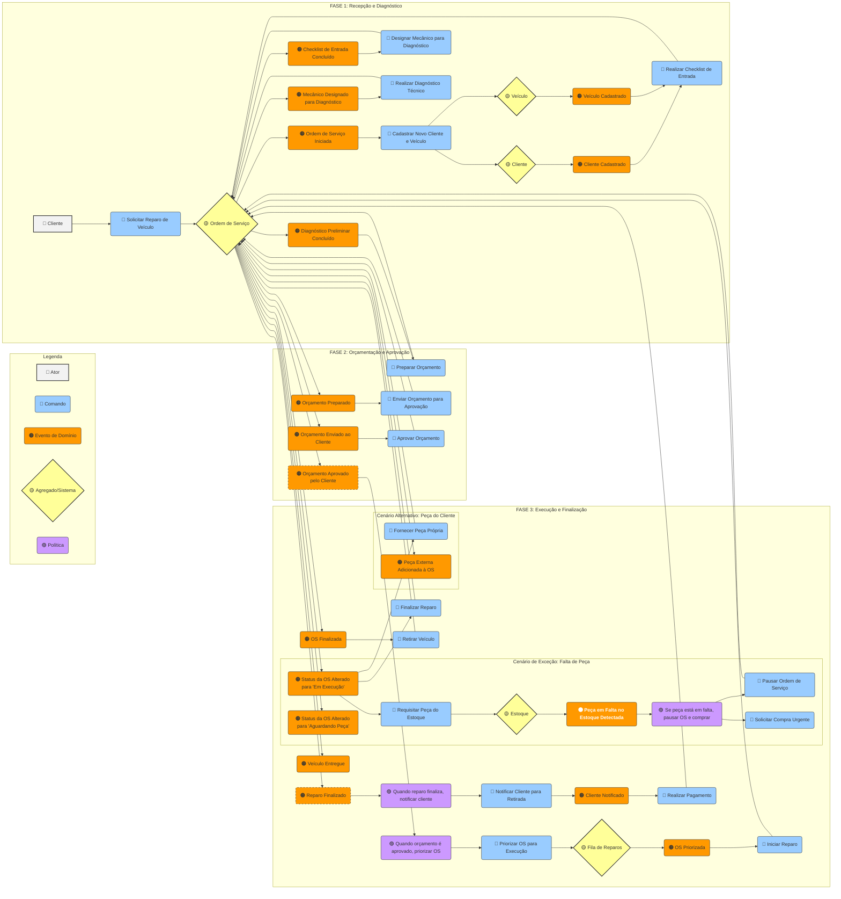
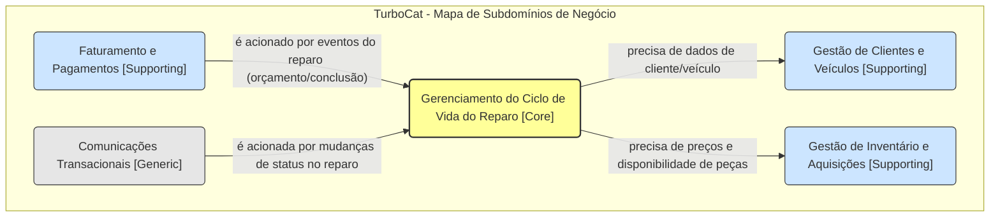
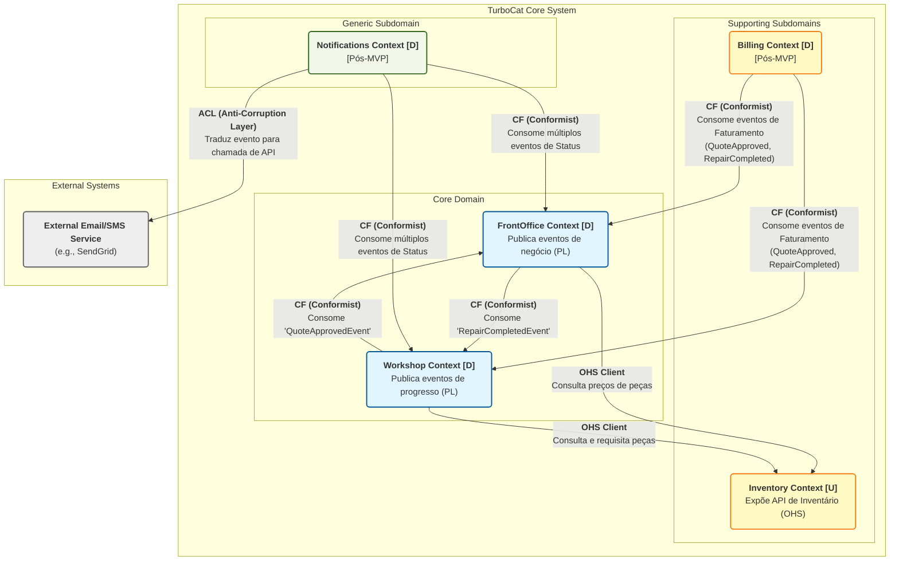
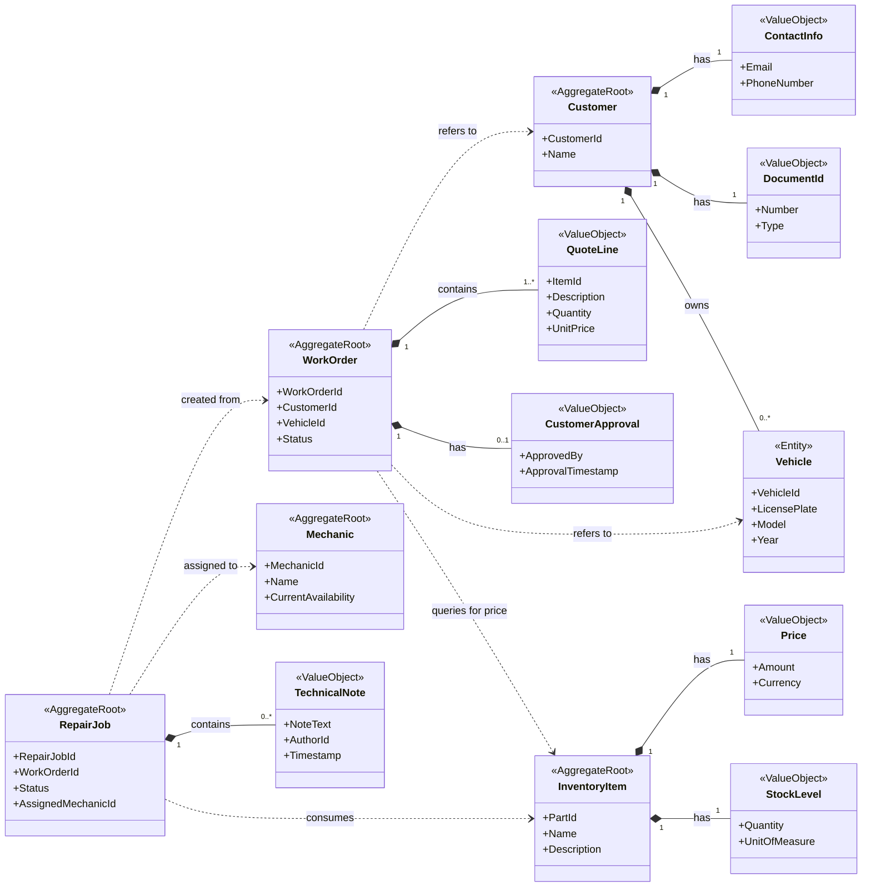
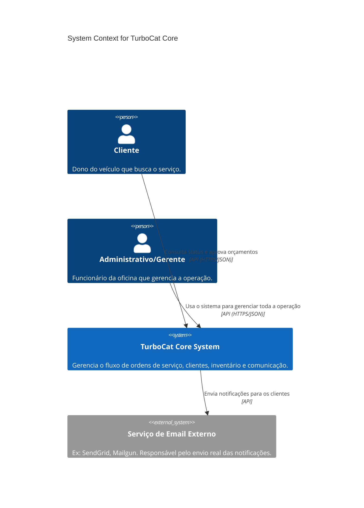
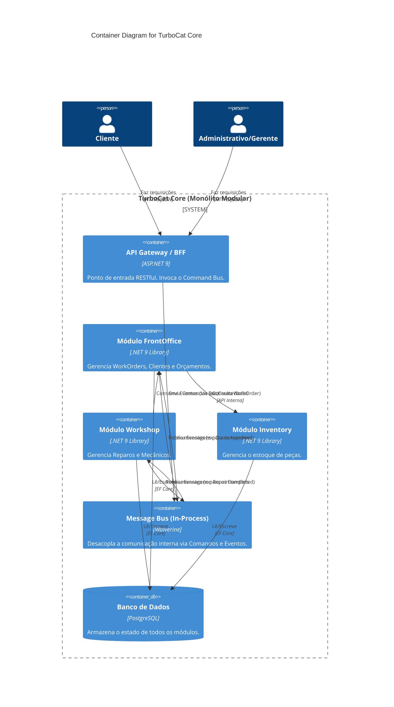
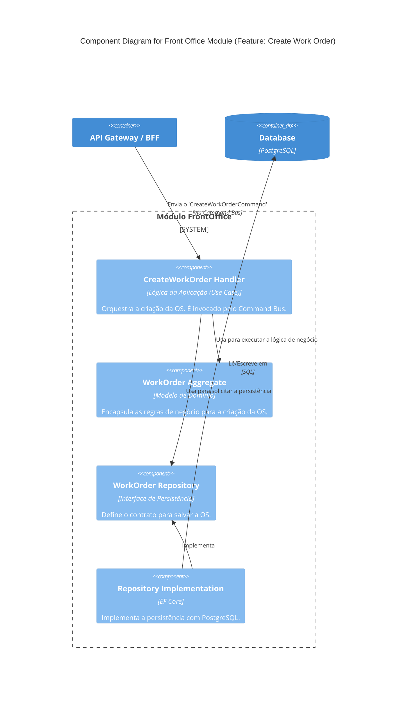

# Solution Design Wiki: TurboCat CatCar

## Índice

1. [Arquivos e Recursos Relacionados](#arquivos-e-recursos-relacionados)
2. [Visão Geral Executiva](#visão-geral-executiva)
3. [Design Estratégico](#design-estratégico)
4. [Declaração de Propósito da Aplicação e KPIs](#declaração-de-propósito-da-aplicação-e-kpis)
5. [Design Tático](#design-tático)
6. [Tecnologias e Stack de Desenvolvimento](#tecnologias-e-stack-de-desenvolvimento)
7. [Arquitetura de Segurança](#arquitetura-de-segurança)
8. [Performance e Escalabilidade](#performance-e-escalabilidade)
9. [Tratamento de Erros e Resiliência](#tratamento-de-erros-e-resiliência)
10. [Estratégia de Testes](#estratégia-de-testes)
11. [Observabilidade e Monitoramento](#observabilidade-e-monitoramento)
12. [Pipeline CI/CD](#pipeline-cicd)
13. [Gestão de Dados](#gestão-de-dados)
14. [C4 Model: Visualizando a Arquitetura](#c4-model-visualizando-a-arquitetura)
15. [Conclusão](#conclusão)
16. [Referências](#referências)
17. [Glossário](#glossário)
18. [Apêndices](#apêndices)

## Arquivos e Recursos Relacionados

| Arquivo | Tipo | Descrição | Status | Prioridade |
|---------|------|-----------|--------|------------|
| [TurboCat_CatCar_Solution_design.md](./TurboCat_CatCar_Solution_design.md) | .md | Documento principal de design da solução | ✅ Atual | Alta |
| [security-architecture.md](./architecture/security-architecture.md) | .md | Especificações de segurança e autenticação | 🔄 Recomendado | Alta |
| [api-specification.yaml](./api/api-specification.yaml) | .yaml | Especificação OpenAPI da REST API | 🔄 Recomendado | Alta |
| [deployment-guide.md](./operations/deployment-guide.md) | .md | Guia de implantação e DevOps | 🔄 Recomendado | Média |
| [testing-strategy.md](./development/testing-strategy.md) | .md | Estratégia e padrões de testes | 🔄 Recomendado | Alta |
| [monitoring-runbook.md](./operations/monitoring-runbook.md) | .md | Procedimentos de monitoramento | 🔄 Recomendado | Média |
| [performance-guide.md](./architecture/performance-guide.md) | .md | Guia de otimização de performance | 🔄 Recomendado | Média |
| [disaster-recovery.md](./operations/disaster-recovery.md) | .md | Plano de recuperação de desastres | 🔄 Recomendado | Baixa |

### Legenda

- ✅ **Atual**: Arquivo existente e atualizado
- 🔄 **Recomendado**: Arquivo sugerido para criação
- ⚠️ **Pendente**: Arquivo que precisa de atualização

## Visão Geral Executiva

- **Author:** 'The TurboCat Architecture Team'
- **Post Slug:** 'solution-design-turbocat-catcar'
- **Featured Image:** '/images/turbocat-architecture-banner.png'
- **Categories:**
  - ***`Software Architecture`***
  - ***`Domain-Driven Design`***
  - ***`Cloud-Native`***

- **Tags:**
  - ***`DDD`***
  - ***`C4 Model`***
  - ***`.NET`***
  - ***`Aspire`***
  - ***`Monolith`***
  - ***`CQRS`***
  - ***`Wolverine`***
- **AI Note:** 'AI was used as a collaborative tool in the design process, as documented in the team profile section.'
- **Summary:** 'Documento de design de solução para o software da oficina TurboCat, detalhando o design estratégico (DDD, Monólito Modular), o escopo do MVP, a definição do Core Domain, o design tático (Agregados, Contratos de Dados), a arquitetura (Vertical Slices, .NET Aspire, C4 Model) e os princípios Cloud-Native adotados.'
- **Post Date:** '20-07-2025'

---

## Introdução

Este documento, intitulado "Solution Design Wiki: TurboCat Core", tem como objetivo principal detalhar a concepção e o design de uma solução de software para a oficina TurboCat. Ele serve como um guia abrangente e um material de consulta contínua para a equipe de desenvolvimento e arquitetura, garantindo alinhamento e consistência durante todas as fases do projeto.

Apresenta os princípios de design estratégico que guiaram as decisões iniciais, o escopo do Produto Mínimo Viável (MVP), a análise dos conceitos de negócio e hipóteses, a definição do Core Domain, o mapeamento do Event Storming e as relações entre os Bounded Contexts.

## Design Estratégico

### Perfil da Equipe

- **Composição**: A equipe é composta por 1 Arquiteto, 1 Desenvolvedor Sênior e a IA Orquestradora.
- **Características**: Trata-se de um time extremamente enxuto, de alta senioridade e com foco em automação. A comunicação é direta e de baixo custo.

### Decisão Conway/Inverse Conway

- **Análise**: Com uma única unidade de desenvolvimento, a arquitetura pode ser coesa. No entanto, existe a visão de uma futura evolução para um sistema distribuído.
- **Decisão**: Adotaremos uma abordagem de Monólito Modular com Máximo Desacoplamento. A arquitetura será unificada para acelerar a entrega inicial, mas os módulos serão projetados com fronteiras claras e comunicação via interfaces bem definidas (Portas), preparando o terreno para uma eventual extração para microsserviços.

### Escopo Imediato (MVP em 1 Mês)

- **Foco Principal**: O escopo deste MVP é a entrega de uma aplicação exclusivamente backend, expondo todas as suas funcionalidades através de uma API RESTful bem definida. Não haverá desenvolvimento de interface de usuário (frontend).
  - **A. Criação da Ordem de Serviço (OS):**
    - Endpoints para identificação/criação de cliente por CPF/CNPJ.
    - Endpoints para cadastro de veículo.
    - Endpoints para criação de OS, incluindo serviços, peças e insumos.
    - Lógica para geração automática de orçamento com base nos itens da OS.
    - Endpoint para registrar a aprovação do orçamento pelo cliente.
  - **B. Acompanhamento da OS:**
    - Gestão do ciclo de vida com os status: Recebida, Em diagnóstico, Aguardando aprovação, Em execução, Finalizada, Entregue.
    - Lógica para alteração automática dos status.
    - Endpoint de consulta pública (para clientes) para acompanhar o progresso da OS.
  - **C. Gestão Administrativa:**
    - API de CRUD para clientes, veículos, serviços e peças (com controle de estoque).
    - Endpoints para listagem e detalhamento de ordens de serviço.
    - Endpoint para monitoramento de dados de tempo médio de execução.
  - **D. Segurança e Qualidade:**
    - Implementação de autenticação JWT para proteger as APIs administrativas.
    - Validação de dados sensíveis em todas as camadas.
    - Implementação de testes unitários e de integração para os endpoints.

### Princípios de Design

- **Design API-First**: A API não é um subproduto; ela é o produto deste MVP. Deve ser projetada com clareza, consistência e boas práticas RESTful.
- **Priorização Agressiva Dentro do Backend**: A equipe deve priorizar o fluxo principal da OS (Criação e Acompanhamento), tratando as funcionalidades de gestão como secundárias.
- **Design para Desacoplamento**: Cada módulo (ex: "Gestão de OS", "Estoque", "Clientes") deve ser o mais independente possível, com comunicação baseada em contratos e eventos.
- **Segurança e Testes desde o Início**: Requisitos de JWT, validação e cobertura de testes são partes integrantes da entrega de cada endpoint.
- **DDD Focado no Essencial**: Aplicar DDD com rigor no Core Domain. A Linguagem Ubíqua é inegociável.
- **Automação Intensiva**: A IA será usada agressivamente para gerar boilerplate de APIs, testes, e acelerar o desenvolvimento.

### Declaração de Idioma do Projeto

- **Idioma Selecionado**: Inglês (en-US).
- **Regra**: Todos os artefatos de código e de domínio devem, obrigatoriamente, ser escritos em inglês.

### Lista de Conceitos de Negócio e Hipóteses

- **Atores e Papéis Principais (Actors & Roles)**: Cliente, Funcionários Administrativos, Gerentes, Mecânico, Fornecedor, Guincheiro.
- **Artefatos e Documentos Chave (Key Artifacts)**: Ordem de Serviço (OS), Checklist de Entrada, Checklist Técnico, Orçamento, Veículo, Peça, Estoque, Garantia.
- **Processos e Verbos do Domínio (Domain Processes & Verbs)**: Recepção, Cadastro, Diagnóstico, Designar mecânico, Preparar Orçamento, Aprovação do Cliente, Execução do Reparo, Priorização, Consultar Status.
- **Conceitos e Linguagem Ubíqua (Ubiquitous Language & Concepts)**: Serviço de Reparo de Confiança, Transparência, Ordem de Chegada, Peça Fornecida pelo Cliente, Status da OS.
- **Dores e Hipóteses de Melhoria (Pains & Hypotheses)**: Perda de histórico, Falha no controle de estoque, Dificuldade em acompanhar status, Priorização reativa, Fluxo de orçamento ineficaz.

### Definição do Core Domain

- **Core Domain**: Gerenciamento do Ciclo de Vida do Reparo Confiável (Reliable Repair Lifecycle Management)
  - **Definição**: O Core Domain é o processo de ponta a ponta que garante que um veículo seja reparado com precisão técnica, qualidade e comunicação transparente, gerenciando e fortalecendo a confiança do cliente. Engloba diagnóstico, orçamento, aprovação, execução e acompanhamento transparente.
- **Justificativa de Negócio**: O verdadeiro ativo da TurboCat é a confiança. O "Serviço de Reparo de Confiança" é o coração do negócio. O software deve ser modelado para proteger e ampliar essa capacidade. Processos como gestão de estoque ou cadastro de clientes são Domínios de Suporte.
- **Diretrizes Estratégicas de Modelagem**: Foco na complexidade essencial, concentrando esforços de modelagem (Aggregates, Events) neste Core Domain.

### Mapa do Event Storming

#### Legenda do Diagrama

- 👤 **Ator (Cinza)**: Pessoa ou sistema que inicia uma ação.
- 🔵 **Comando (Azul)**: Ação ou intenção de um usuário que o sistema deve processar.
- 🟠 **Evento de Domínio (Laranja)**: Fato relevante para o negócio que ocorreu no passado.
- 🟡 **Agregado/Sistema (Amarelo)**: Onde as regras de negócio são aplicadas e os eventos são gerados.
- 🟣 **Política (Roxo/Lilás)**: Regra de negócio do tipo "Sempre que [Evento X] acontecer, então [Comando Y]".

#### Diagrama de Fluxo



### Declaração de Propósito da Aplicação e KPIs

- **Missão da Aplicação**: Empoderar a oficina TurboCat com uma ferramenta digital que transforme seu "caos funcional" em uma eficiência transparente, automatizando tarefas repetitivas e fornecendo dados precisos para fortalecer o "Serviço de Reparo de Confiança" que é o coração do seu negócio.
- **Problemas Prioritários a Resolver (Foco do MVP) e KPIs de Sucesso**:
  - **CRÍTICO - Visibilidade do Serviço**:
    - **Problema**: Eliminar a incerteza sobre o andamento dos reparos.
    - **KPI Associado**: Reduzir em 50% o número de ligações de clientes perguntando sobre o status da OS em até 3 meses.
  - **ALTO - Confiabilidade do Inventário**:
    - **Problema**: Garantir a acurácia do inventário para evitar paralisações.
    - **KPI Associado**: Reduzir o "Tempo de Espera por Peça" em 70% para itens em estoque.
  - **MÉDIO - Eficiência do Fluxo de Trabalho**:
    - **Problema**: Agilizar a criação de valor.
    - **KPI Associado**: Diminuir em 30% o tempo médio entre a "Ordem de Serviço Iniciada" e o "Orçamento Aprovado pelo Cliente".

### Definição das Relações do Context Map

- **Relação #1: Front Office -> Workshop (Pub/Sub)**: Front Office (Upstream) publica `QuoteApprovedByCustomer`. Workshop (Downstream) assina o evento.
- **Relação #2: Workshop e Inventário (OHS/PL)**: Inventário (Upstream) expõe uma API. Workshop (Downstream) consome para consultar e requisitar peças.
- **Relação #3: Front Office e Inventário (OHS/PL)**: Inventário (Upstream) expõe a mesma API. Front Office (Downstream) consome para obter preços para o orçamento.
- **Relação #4: Workshop -> Front Office (Pub/Sub)**: Workshop (Upstream) publica eventos de progresso (`RepairExecutionStarted`, `RepairCompleted`). Front Office (Downstream) assina para atualizar o status da OS.

### Matriz de Rastreabilidade (Problemas vs. Componentes)

| Problema de Negócio            | Componente de Software Responsável                                                    |
| ------------------------------ | ------------------------------------------------------------------------------------- |
| **Visibilidade do Serviço**    | Agregado `WorkOrder` (status), Agregado `RepairJob` (status técnico), Eventos de status (Pub/Sub). |
| **Confiabilidade do Inventário** | Contexto `Inventory & Procurement`, Agregado `InventoryItem`, Agregado `PurchaseOrder`.    |
| **Eficiência do Fluxo de Trabalho** | Agregado `Customer` (histórico), Agregado `WorkOrder` (fluxo de orçamento), Contratos de Leitura (DTOs). |

### Subdomínios Identificados (O Espaço do Problema)

Esta é a decomposição do negócio da TurboCat em suas áreas lógicas, classificadas por sua importância estratégica.

- **Core Domain (Domínio Central)**:
  - **Nome**: Gerenciamento do Ciclo de Vida do Reparo Confiável (WorkShop)
  - **Descrição**: O processo de ponta a ponta que engloba o diagnóstico técnico, a criação e aprovação do orçamento, a execução do reparo e o acompanhamento transparente do status. É a principal fonte de valor e diferencial competitivo da oficina: a confiança do cliente.
- **Supporting Subdomains (Domínios de Suporte)**:
  - **Nome**: Gestão de Inventário e Aquisições (Inventory)
  - **Descrição**: Controla o estoque de peças, gerencia fornecedores e o processo de aquisição de novos itens. É vital para a operação, mas não é o diferencial competitivo. É um problema complexo, mas já resolvido (um "solved problem").
  - **Nome**: Gestão de Clientes e Veículos (FrontOffice)
  - **Descrição**: Gerencia o cadastro, o histórico e os dados de contato dos clientes, bem como as informações dos seus veículos. É um CRM simplificado, necessário para habilitar o Core Domain.
  - **Nome**: Faturamento e Pagamentos (Billing)
  - **Descrição**: Lida com a geração de faturas (invoices), processamento de pagamentos e registros financeiros. É um processo financeiro padrão, essencial para o negócio, mas não é único.
- **Generic Subdomain (Domínio Genérico)**:
  - **Nome**: Comunicações Transacionais (Notification)
  - **Descrição**: O envio de notificações (e-mail, SMS) para os clientes sobre mudanças de status, orçamentos prontos, etc. Este é um problema genérico, altamente padronizado e ideal para ser resolvido com uma ferramenta ou serviço de mercado.

### Bounded Contexts Identificados (Contextos Delimitados)

Para garantir o máximo desacoplamento e a alta coesão do sistema, a solução TurboCat CatCar é decomposta nos seguintes Bounded Contexts. Cada contexto representa uma fronteira explícita em torno de um modelo de domínio consistente e alinhado a uma capacidade de negócio específica.

#### FrontOffice Context

- **Responsabilidade Principal**: Gerenciar toda a interação com o cliente, desde a criação da Ordem de Serviço até a aprovação do orçamento.
- **Tipo de Subdomínio**: Core Domain. A qualidade da interação neste contexto impacta diretamente a percepção de confiança do cliente.
- **Agregados Principais**: `WorkOrder`, `Customer`, `Vehicle`.
- **Descrição**: Este contexto é a porta de entrada para os serviços da oficina. Ele lida com o agendamento, o registro de informações do cliente e do veículo, a criação da Ordem de Serviço (WorkOrder) e a comunicação do orçamento para aprovação.

#### Workshop Context

- **Responsabilidade Principal**: Orquestrar a execução do reparo físico do veículo e gerenciar os recursos técnicos.
- **Tipo de Subdomínio**: Core Domain. A eficiência e a qualidade do trabalho realizado aqui são o cerne do serviço prestado.
- **Agregados Principais**: `RepairJob`, `Mechanic`.
- **Descrição**: É o coração da operação. Uma vez que uma `WorkOrder` é aprovada, o Workshop Context assume, criando `RepairJobs` específicos, alocando mecânicos, registrando o progresso técnico e emitindo as atualizações de status que serão consumidas por outros contextos.

#### Inventory Context

- **Responsabilidade Principal**: Controlar o estoque de peças, gerenciar fornecedores e o processo de aquisição de novos itens.
- **Tipo de Subdomínio**: Supporting Subdomain. É essencial para o negócio, mas não é o diferencial competitivo principal.
- **Agregados Principais**: `InventoryItem`, `PurchaseOrder`, `Supplier`.
- **Descrição**: Gerencia a disponibilidade, o custo e a localização das peças no estoque. Expõe uma API (Open-Host Service) para que outros contextos, principalmente o Workshop, possam consultar e requisitar itens necessários para os reparos.

#### Billing Context

- **Responsabilidade Principal**: Lidar com todo o processo de faturamento, cobrança e registro de pagamentos.
- **Tipo de Subdomínio**: Supporting Subdomain.
- **Agregados Principais**: `Invoice`, `Payment`.
- **Descrição**: Ativado por eventos como a aprovação de um orçamento ou a conclusão de um serviço, este contexto é responsável por gerar as faturas, processar os pagamentos e manter um registro financeiro preciso de cada Ordem de Serviço.

#### Notifications Context

- **Responsabilidade Principal**: Gerenciar o envio de todas as comunicações transacionais externas para os clientes.
- **Tipo de Subdomínio**: Generic Subdomain.
- **Agregados Principais**: `NotificationRequest`.
- **Descrição**: Atua como um serviço centralizado e desacoplado para o envio de notificações (e.g., e-mails, SMS). Ele consome eventos de outros contextos (como uma mudança de status no Workshop) e os traduz em comunicações claras para o cliente, utilizando serviços externos.

### Mapeamento Subdomínios (Problema) x Bounded Contexts (Solução)

| Subdomínio (Problema)                   | Bounded Context (Solução)                  |
| --------------------------------------- | ------------------------------------------ |
| Gerenciamento do Ciclo de Vida do Reparo | `FrontOffice Context` + `Workshop Context` |
| Gestão de Inventário e Aquisições       | `Inventory Context`                        |
| Gestão de Clientes e Veículos           | `FrontOffice Context`                      |
| Faturamento e Pagamentos                | `Billing Context`                          |
| Comunicações Transacionais              | `Notifications Context`                    |

O Core Domain é tão complexo que foi dividido em dois Bounded Contexts (`FrontOffice` e `Workshop`) para gerenciar melhor as responsabilidades. Por outro lado, o `FrontOffice Context` absorveu a responsabilidade do subdomínio de suporte de "Gestão de Clientes" por uma questão de coesão do fluxo de trabalho.

### Mapas Visuais dos Contextos

#### Visão de Subdomínios (O Espaço do Problema)

**Propósito**: Este mapa foca nas áreas de negócio e em como elas dependem umas das outras. Ele ignora a tecnologia e mostra as relações de poder e influência entre os domínios. A seta `-->` indica uma dependência, onde um domínio precisa de informações ou é acionado por outro.



#### Visão de Bounded Contexts (O Espaço da Solução)

**Propósito**: Este mapa mostra os módulos de software (Bounded Contexts) e os padrões de integração técnica entre eles. A notação `[U]` significa Upstream (fornecedor do modelo/API) e `[D]` significa Downstream (consumidor, que se conforma ao modelo do Upstream). As setas apontam do Downstream para o Upstream.



### Dicionário da Linguagem Ubíqua

Este dicionário é a fonte única da verdade para os termos de negócio e seus equivalentes técnicos. Ele está organizado em categorias para facilitar a consulta e garantir que toda a equipe — negócio, desenvolvimento e IA — fale a mesma língua.

#### Atores e Papéis Principais (Actors & Roles)

| Termo (Negócio)        | Term (Código)            | Definição no Contexto                                                                                                         |
| ---------------------- | ------------------------ | ----------------------------------------------------------------------------------------------------------------------------- |
| **Cliente**            | `Customer`               | Pessoa ou empresa proprietária de veículos que solicita os serviços. É uma Raiz de Agregado.                                   |
| **Administrativo/Gerente** | `AdministrativeStaff (Role)` | Usuário interno do sistema responsável por criar a OS, preparar orçamentos e se comunicar com o cliente. Não é um agregado, mas um papel de usuário. |
| **Mecânico**           | `Mechanic`               | Recurso técnico da oficina responsável pela execução do reparo. É uma Raiz de Agregado no `Workshop Context`.                    |

#### Artefatos e Documentos Chave (Key Artifacts)

| Termo (Negócio)        | Term (Código) | Definição no Contexto                                                                                                      | Contexto Principal |
| ---------------------- | ------------- | -------------------------------------------------------------------------------------------------------------------------- | ------------------ |
| **Ordem de Serviço (OS)** | `WorkOrder`   | O agregado central que representa o contrato com o cliente. Rastreia o ciclo de vida completo do serviço sob a perspectiva do cliente. | `FrontOffice`      |
| **Orçamento**          | `Quote`       | Componente da `WorkOrder`, não um agregado separado. Representa a lista de peças e serviços (`QuoteLine`) e seu estado (`CustomerApproval`). | `FrontOffice`      |
| **Linha do Orçamento**   | `QuoteLine`   | Objeto de Valor (VO) dentro da `WorkOrder` que detalha um único item (peça ou serviço) a ser cobrado.                         | `FrontOffice`      |
| **Reparo / Serviço Técnico** | `RepairJob`   | O agregado que representa a execução técnica interna do trabalho, criado após a aprovação do `Quote`.                         | `Workshop`         |
| **Peça / Item de Estoque** | `InventoryItem` | Um item de catálogo que representa um tipo de peça ou produto. Gerencia o preço e o nível de estoque (`StockLevel`).           | `Inventory`        |

#### Processos e Verbos do Domínio (Domain Processes & Verbs)

| Termo (Negócio)         | Comando            | Descrição do Processo                                                                             |
| ----------------------- | ------------------ | ------------------------------------------------------------------------------------------------- |
| **Criar Ordem de Serviço** | `CreateWorkOrder`  | Inicia um novo fluxo de reparo, associando um cliente e um veículo a uma nova OS.                 |
| **Preparar Orçamento**    | `AddQuoteLine`     | Adicionar itens (peças e serviços) a uma `WorkOrder` para compor o orçamento.                     |
| **Aprovar Orçamento**     | `ApproveQuote`     | Ação do cliente que marca um orçamento como aprovado, permitindo o início do `RepairJob`.         |
| **Designar Mecânico**     | `AssignMechanic`   | Alocar um mecânico disponível e qualificado a um `RepairJob` específico.                          |
| **Iniciar Reparo**        | `StartRepair`      | Mudar o status de um `RepairJob` para "Em Execução", indicando que o trabalho ativo começou.      |
| **Ajustar Estoque**       | `AdjustStock`      | Aumentar ou diminuir a contagem de um `InventoryItem` (ex: após uma venda ou recebimento).       |

#### Estados e Ciclos de Vida (States & Lifecycles)

| Conceito (Negócio)                | Term (Código / Enum)    | Valores e Significado                                                                                             |
| --------------------------------- | ----------------------- | ----------------------------------------------------------------------------------------------------------------- |
| **Status da OS (Visível ao Cliente)** | `WorkOrderStatus`       | `Received`, `InDiagnosis`, `AwaitingApproval`, `InExecution`, `Completed`, `Delivered`. Reflete as macro-fases do serviço. |
| **Status do Reparo (Interno)**      | `RepairJobStatus`       | `Pending`, `InProgress`, `AwaitingParts`, `Paused`, `QualityCheck`, `Finished`. Detalha o estado operacional do trabalho na oficina. |
| **Disponibilidade do Mecânico**   | `MechanicAvailability`  | `Available`, `OnJob`, `OnLeave`. Controla se um mecânico pode ser alocado.                                         |

#### Conceitos e Qualificadores (Concepts & Qualifiers)

| Conceito (Negócio)          | Implementação no Modelo      | Descrição                                                                                                                                                 |
| --------------------------- | ---------------------------- | --------------------------------------------------------------------------------------------------------------------------------------------------------- |
| **Serviço de Confiança**    | (Diretriz Arquitetural)      | O princípio de negócio que guia o design. Manifesta-se através da transparência de status (`WorkOrderStatus`) e da precisão do `Quote`.                     |
| **Peça Fornecida pelo Cliente** | Flag/Atributo na `QuoteLine` | Uma regra de negócio que indica que um item no orçamento não deve ser retirado do estoque nem cobrado. O agregado `WorkOrder` deve saber lidar com isso. |
| **Transparência**           | (Atributo de Qualidade)      | A capacidade do sistema de fornecer informações de status claras e atualizadas, tanto para clientes (`WorkOrderStatus`) quanto para gerentes (`RepairJobStatus`). |

## Design Tático

### Exploração Preliminar do Modelo Tático

#### Blueprint dos Agregados, Entidades e VOs

Este blueprint detalha os Agregados para cada Bounded Context, explicitando seus atributos, regras de negócio (invariantes), e o comportamento esperado através de Comandos e Eventos de Domínio.

##### Contexto: FrontOffice

- **`WorkOrder` (Aggregate Root)**: Orquestra o ciclo de vida da solicitação de serviço, desde a criação até a aprovação do orçamento pelo cliente.
  - **ATRIBUTOS**: `WorkOrderId`, `CustomerId`, `VehicleId`, `Status` (enum), `List<QuoteLine>`, `CustomerApproval`.
  - **COMPONENTES**:
    - **`QuoteLine` (Objeto de Valor)**: Lista de linhas do orçamento (`ItemId`, `Description`, `Quantity`, `UnitPrice`, `Type`).
    - **`CustomerApproval` (Objeto de Valor)**: Detalhes da aprovação (`ApprovedBy`, `ApprovalTimestamp`, `ApprovalMethod`).
  - **INVARIANTES**:
    - Uma `WorkOrder` deve sempre estar associada a um `Customer` e um `Vehicle` existentes.
    - Itens do orçamento (`QuoteLines`) só podem ser adicionados/removidos antes do orçamento ser enviado ao cliente.
    - A aprovação do cliente só pode ser registrada após o orçamento ser enviado.
    - As transições de `Status` devem seguir um fluxo predefinido (ex: Recebida -> Em Diagnóstico -> Aguardando Aprovação).
  - **COMMANDOS**: `CreateWorkOrder`, `AddQuoteLine`, `SendQuoteForApproval`, `ApproveQuote`, `RejectQuote`.
  - **EVENTOS**: `WorkOrderCreated`, `QuoteLineAdded`, `QuoteSentForApproval`, `QuoteApprovedByCustomer`, `QuoteRejectedByCustomer`.

- **`Customer` (Aggregate Root)**: Gerencia os dados cadastrais do cliente e a lista de seus veículos.
  - **ATRIBUTOS**: `CustomerId`, `Name`, `ContactInfo`, `DocumentId`, `List<Vehicle>`.
  - **COMPONENTES**:
    - **`Vehicle` (Entity)**: Lista de veículos do cliente.
    - **`ContactInfo` (Value Object)**: Dados de contato (`Email`, `PhoneNumber`).
    - **`DocumentId` (Value Object)**: Documento de identificação (`Number`, `Type`).
  - **INVARIANTES**:
    - O `DocumentId` (CPF/CNPJ) deve ser único no sistema.
    - Um veículo não pode ser adicionado duas vezes ao mesmo cliente.
  - **COMMANDOS**: `RegisterNewCustomer`, `UpdateContactInfo`, `AddVehicleToCustomer`.
  - **EVENTOS**: `CustomerRegistered`, `CustomerContactInfoUpdated`, `VehicleAddedToCustomer`.

- **`Vehicle` (Entity)**: Representa um veículo específico de um cliente. Não é uma raiz de agregado.
  - **ATRIBUTOS**: `VehicleId`, `LicensePlate`, `Model`, `Year`, `Color`.
  - **INVARIANTES**: Suas regras são garantidas pelo agregado `Customer`.

##### Contexto: Workshop

- **`RepairJob` (Aggregate Root)**: Representa a execução do trabalho técnico na oficina após a aprovação do orçamento.
  - **ATRIBUTOS**: `RepairJobId`, `WorkOrderId`, `Status` (enum), `List<TechnicalNote>`, `AssignedMechanicId`.
  - **COMPONENTES**:
    - **`TechnicalNote` (Value Object)**: Lista de anotações técnicas (`NoteText`, `AuthorId`, `Timestamp`).
  - **INVARIANTES**:
    - Só pode ser criado a partir de uma `WorkOrder` com o orçamento aprovado.
    - Um mecânico deve ser designado antes que o `Status` mude para "Em Execução".
  - **COMMANDOS**: `CreateRepairJob`, `AssignMechanic`, `StartRepair`, `AddTechnicalNote`, `CompleteRepair`.
  - **EVENTOS**: `RepairJobCreated`, `MechanicAssignedToJob`, `RepairStarted`, `TechnicalNoteAdded`, `RepairCompleted`.

- **`Mechanic` (Aggregate Root)**: Representa o mecânico como um recurso da oficina.
  - **ATRIBUTOS**: `MechanicId`, `Name`, `Specializations` (List), `CurrentAvailability` (enum).
  - **COMPONENTES**:
    - **`Specializations` (`List<string>`)**: Lista de especialidades.
  - **INVARIANTES**: A disponibilidade deve ser gerenciada de forma consistente.
  - **COMMANDOS**: `RegisterNewMechanic`, `UpdateAvailability`, `AddSpecialization`.
  - **EVENTOS**: `MechanicRegistered`, `MechanicAvailabilityUpdated`.

##### Contexto: Inventory

- **`InventoryItem` (Aggregate Root)**: Gerencia uma peça ou insumo específico no estoque.
  - **ATRIBUTOS**: `PartId`, `Name`, `Description`, `Price`, `StockLevel`.
  - **COMPONENTES**:
    - **`Price` (Value Object)**: Preço da peça (`Amount`, `Currency`).
    - **`StockLevel` (Value Object)**: Quantidade em estoque (`Quantity`, `UnitOfMeasure`).
  - **INVARIANTES**: `StockLevel` não pode ser negativo. O preço não pode ser negativo.
  - **COMMANDOS**: `RegisterNewPart`, `AdjustStock`, `UpdatePrice`.
  - **EVENTOS**: `NewPartRegistered`, `StockAdjusted`, `PartPriceUpdated`.

##### Contexto: Billing (Pós-MVP)

- **`Invoice` (Aggregate Root)**: Representa uma fatura financeira a ser paga pelo cliente.
  - **ATRIBUTOS**: `InvoiceId`, `WorkOrderId`, `TotalAmount`, `Status` (enum), `DueDate`.
  - **INVARIANTES**: O valor total deve corresponder ao orçamento aprovado. Não pode ser alterada após ser paga.
  - **COMMANDOS**: `GenerateInvoice`, `MarkAsPaid`, `MarkAsOverdue`.
  - **EVENTOS**: `InvoiceGenerated`, `InvoicePaid`, `InvoiceMarkedAsOverdue`.

- **`Payment` (Aggregate Root)**: Representa um pagamento efetuado.
  - **ATRIBUTOS**: `PaymentId`, `InvoiceId`, `AmountPaid`, `PaymentMethod` (enum), `PaymentTimestamp`.
  - **INVARIANTES**: O valor pago não pode exceder o valor devido da fatura.
  - **COMMANDOS**: `RecordPayment`.
  - **EVENTOS**: `PaymentRecorded`.

##### Contexto: Notifications (Pós-MVP)

- **`NotificationRequest` (Aggregate Root)**: Gerencia uma única solicitação de notificação a ser enviada.
  - **ATRIBUTOS**: `NotificationId`, `Recipient`, `Channel` (Email/SMS), `Message`, `Status` (enum).
  - **INVARIANTES**: Deve ter um destinatário e uma mensagem válidos.
  - **COMMANDOS**: `SendNotification`.
  - **EVENTOS**: `NotificationSent`, `NotificationFailed`.

#### Diagrama de Classes dos Agregados

O diagrama a seguir representa visualmente a estrutura detalhada dos Agregados, Entidades e Objetos de Valor para cada Bounded Context, incluindo seus atributos principais e as relações entre eles.



### Formalização dos Contratos de Dados

Os contratos de dados são essenciais para definir as fronteiras de comunicação do sistema e são categorizados em três tipos principais:

#### Diretriz Geral de Serialização

- **Comunicação Externa (API para Clientes)**: Utiliza JSON, por ser o padrão web, legível e universalmente suportado.
- **Comunicação Interna (Entre Bounded Contexts)**: Prioriza Protobuf (Protocol Buffers) para troca de eventos via Message Bus, devido à sua natureza binária, performance e tipagem forte, ideal para comunicação entre serviços.

#### Contratos de API Externa (JSON DTOs)

São os DTOs (Data Transfer Objects) que estruturam os dados para requisições (input) e respostas (output) da API RESTful.

**Exemplo de Input (Comando): `POST /v1/work-orders`**
Payload para criar uma nova Ordem de Serviço.

```json
{
  "customerId": "c4b5c6d7-1b3a-4e9a-9b1e-0a1b2c3d4e5f",
  "vehicleId": "a1b2c3d4-5e6f-7a8b-9c0d-1e2f3a4b5c6d",
  "problemDescription": "Veículo não liga e faz barulho estranho ao girar a chave."
}
```

**Exemplo de Output (Query): `GET /v1/work-orders/{id}/status`**
Resposta simplificada para consulta pública de status de uma OS.

```json
{
  "workOrderId": "f4a5b6c7-8d9e-0f1a-2b3c-4d5e6f7a8b9c",
  "vehicleDescription": "Toyota Corolla 2022 (ABC-1234)",
  "currentStatus": "AwaitingApproval",
  "statusDescription": "Orçamento enviado. Aguardando aprovação do cliente.",
  "lastUpdate": "2025-07-23T14:30:00Z"
}
```

#### Contratos de Eventos Internos (Protobuf)

São eventos de domínio publicados no Message Bus para comunicação assíncrona entre Bounded Contexts.

**Exemplo: `QuoteApprovedByCustomerEvent.proto`**
Evento publicado pelo `FrontOffice Context` quando um orçamento é aprovado, para ser consumido pelo `Workshop Context`.

```proto
syntax = "proto3";

package turbocat.events.v1;

// Evento disparado quando um cliente aprova um orçamento.
message QuoteApprovedByCustomerEvent {
  string work_order_id = 1;
  string customer_id = 2;
  
  // Informações básicas do veículo para contexto rápido.
  string vehicle_info = 3;

  // Lista de itens que foram aprovados para o reparo.
  repeated ApprovedItem approved_items = 4;
}

// Representa um item individual aprovado no orçamento.
message ApprovedItem {
  string item_id = 1;
  string description = 2;
  int32 quantity = 3;
  ItemType type = 4; // Distingue entre PEÇA e SERVIÇO.
}

enum ItemType {
  ITEM_TYPE_UNSPECIFIED = 0;
  PART = 1;
  SERVICE = 2;
}
```

#### Contratos de Leitura (Query DTOs)

São DTOs otimizados para leitura, desnormalizando dados de múltiplos agregados ou contextos para servir uma tela ou consulta específica de forma eficiente (princípio do CQRS).

**Exemplo: `WorkOrderDetailsDto.cs`**
DTO retornado por `GET /v1/work-orders/{id}` para a visão administrativa, contendo dados de múltiplos agregados.

```csharp
public record WorkOrderDetailsDto
{
    // Dados do agregado WorkOrder (FrontOffice)
    public Guid WorkOrderId { get; init; }
    public string Status { get; init; }
    public string ProblemDescription { get; init; }
    public DateTime CreatedAt { get; init; }

    // Dados do agregado Customer (FrontOffice)
    public Guid CustomerId { get; init; }
    public string CustomerName { get; init; }
    public string CustomerContactPhone { get; init; }

    // Dados da entidade Vehicle (FrontOffice)
    public Guid VehicleId { get; init; }
    public string VehicleLicensePlate { get; init; }
    public string VehicleModel { get; init; }

    // Lista de linhas do orçamento (VO do WorkOrder)
    public IReadOnlyList<QuoteLineDto> QuoteLines { get; init; } = [];

    // Detalhes da aprovação (VO do WorkOrder)
    public CustomerApprovalDto? ApprovalDetails { get; init; }
}

public record QuoteLineDto(string Description, int Quantity, decimal UnitPrice, string Type);
public record CustomerApprovalDto(string ApprovedBy, DateTime ApprovalTimestamp);
```

### Design de Integração e Resiliência

Esta seção detalha as estratégias de comunicação e tolerância a falhas para os principais pontos de integração entre os Bounded Contexts, conforme mapeado na seção 2.10.

#### Ficha de Integração #1: Front Office [U] -> Workshop [D]

- **Ponto de Integração**: Comunicação da aprovação de um orçamento para o início do trabalho.
- **Gatilho de Negócio**: O cliente aprova o orçamento no `FrontOffice Context`.
- **Padrão de Integração**: Publish/Subscribe (Pub/Sub). O FrontOffice publica um evento `QuoteApprovedByCustomerEvent`. O Workshop é um assinante (subscriber) deste evento.
- **Estratégia de Resiliência**:
  - **Na Publicação (FrontOffice)**: Será utilizado o **Outbox Pattern**. A gravação da aprovação no banco de dados e a criação da mensagem do evento são feitas em uma única transação atômica. Um processo em segundo plano garante a entrega da mensagem ao broker, mesmo que o broker esteja temporariamente indisponível no momento da transação.
  - **No Consumo (Workshop)**: O handler do evento será **idempotente**. Em caso de falha no processamento, serão aplicadas retentativas com **backoff exponencial**. Se as falhas persistirem, a mensagem será movida para uma **Dead-Letter Queue (DLQ)** para análise manual, evitando o bloqueio da fila principal.
- **Justificativa**: O desacoplamento é máximo. O FrontOffice não precisa saber ou se importar com o que acontece após a aprovação, apenas garante que o evento seja publicado.

#### Ficha de Integração #2: Workshop [D] -> Inventory [U]

- **Ponto de Integração**: Consulta e reserva de peças para um reparo.
- **Gatilho de Negócio**: Um mecânico no Workshop precisa verificar a disponibilidade ou requisitar uma peça para um `RepairJob`.
- **Padrão de Integração**: Open-Host Service (OHS). O `Inventory Context` expõe uma API síncrona (RESTful/gRPC) que o Workshop consome como um cliente.
- **Estratégia de Resiliência**:
  - **No Cliente (Workshop)**: Será implementado o padrão **Circuit Breaker**. Se a API do Inventory começar a falhar ou ficar lenta, o circuito "abre" e as chamadas subsequentes falham imediatamente por um período, protegendo o Workshop de ficar travado.
  - **Timeouts Agressivos**: As chamadas à API terão um timeout curto (ex: 500ms) para evitar longas esperas.
  - **Fallback**: Em caso de falha na comunicação, o sistema deve registrar a falha e potencialmente mover o `RepairJob` para um status de "Aguardando Peça (Sistema de Inventário Indisponível)", notificando a equipe administrativa.
- **Justificativa**: A necessidade de dados é em tempo real. O Workshop precisa de uma resposta imediata sobre a disponibilidade da peça para prosseguir. A comunicação assíncrona não seria adequada para este caso de uso.

#### Ficha de Integração #3: Front Office [D] -> Inventory [U]

- **Ponto de Integração**: Consulta de preços de peças para montagem de um orçamento.
- **Gatilho de Negócio**: Um funcionário administrativo no FrontOffice adiciona uma peça a uma `WorkOrder`.
- **Padrão de Integração**: Open-Host Service (OHS), consumindo a mesma API do `Inventory Context`.
- **Estratégia de Resiliência**: Idêntica à da Ficha #2 (Circuit Breaker e Timeouts Agressivos). A falha em obter um preço não pode impedir a operação do FrontOffice. O sistema pode, como fallback, permitir a inserção manual do preço.
- **Justificativa**: Necessidade de dados de preços em tempo real para garantir a precisão do orçamento.

### Tecnologias e Stack de Desenvolvimento

- **Linguagem**: C# com .NET 9.
- **Framework Principal**: .NET 9 com .NET Aspire para orquestração de desenvolvimento.
- **Command Bus / Mensageria**: Wolverine.
- **Tratamento de Resultados**: RiseOn.ResultRail.
- **Validação**: FluentValidation.
- **Banco de Dados**: PostgreSQL (gerenciado via .NET Aspire).
- **ORM**: Entity Framework Core.

## Arquitetura de Segurança

### Autenticação e Autorização

#### Implementação JWT

- **Token Lifecycle**: Tokens JWT com expiração de 15 minutos
- **Refresh Tokens**: Tokens de renovação válidos por 7 dias
- **Algoritmo**: RS256 com chaves RSA de 2048 bits

```csharp
// Configuração JWT Segura
services.AddAuthentication(JwtBearerDefaults.AuthenticationScheme)
    .AddJwtBearer(options =>
    {
        options.TokenValidationParameters = new TokenValidationParameters
        {
            ValidateIssuer = true,
            ValidateAudience = true,
            ValidateLifetime = true,
            ValidateIssuerSigningKey = true,
            ValidIssuer = configuration["Jwt:Issuer"],
            ValidAudience = configuration["Jwt:Audience"],
            IssuerSigningKey = new RsaSecurityKey(GetRSAKey()),
            ClockSkew = TimeSpan.Zero
        };
    });
```

#### Modelo RBAC (Role-Based Access Control)

| Papel | Permissões | Contextos de Acesso |
|-------|------------|-------------------|
| **Admin** | Todas as operações | Todos os contextos |
| **Manager** | Gerenciamento de OS, relatórios | FrontOffice, Workshop |
| **Mechanic** | Execução de reparos, atualização de status | Workshop |
| **Customer** | Consulta de status, aprovação de orçamentos | FrontOffice (limitado) |

### Proteção de Dados

#### Criptografia

- **Em Trânsito**: TLS 1.3 obrigatório para todas as comunicações
- **Em Repouso**: AES-256 para dados sensíveis (PII, documentos)
- **Chaves**: Azure Key Vault ou HashiCorp Vault para gerenciamento

#### Tratamento de PII

```csharp
// Exemplo de criptografia de dados sensíveis
public class EncryptedCustomerData
{
    [Encrypted]
    public string DocumentId { get; set; }
    
    [Encrypted]
    public string PhoneNumber { get; set; }
    
    public string Name { get; set; } // Não sensível, não criptografado
}
```

### Segurança da API

#### Rate Limiting

```csharp
services.AddRateLimiter(options =>
{
    options.GlobalLimiter = PartitionedRateLimiter.Create<HttpContext, string>(
        context => RateLimitPartition.GetFixedWindowLimiter(
            partitionKey: context.User?.Identity?.Name ?? context.Request.Headers.Host.ToString(),
            factory: partition => new FixedWindowRateLimiterOptions
            {
                AutoReplenishment = true,
                PermitLimit = 100,
                Window = TimeSpan.FromMinutes(1)
            }));
});
```

#### Validação de Entrada

```csharp
public class CreateWorkOrderValidator : AbstractValidator<CreateWorkOrderCommand>
{
    public CreateWorkOrderValidator()
    {
        RuleFor(x => x.ProblemDescription)
            .NotEmpty()
            .MaximumLength(500)
            .Must(BeValidInput).WithMessage("Entrada contém caracteres suspeitos");
    }
    
    private bool BeValidInput(string input)
    {
        // Validação contra XSS e SQL Injection
        return !input.Contains("<script") && !input.Contains("'");
    }
}
```

### Auditoria e Logging

#### Log de Auditoria

```csharp
public class AuditLogEntry
{
    public DateTime Timestamp { get; set; }
    public string UserId { get; set; }
    public string Action { get; set; }
    public string ResourceId { get; set; }
    public string Details { get; set; }
    public string IpAddress { get; set; }
}
```

## Performance e Escalabilidade

### Otimização de Banco de Dados

#### Estratégia de Indexação

```sql
-- Índices críticos para performance
CREATE INDEX IX_WorkOrder_Status_CreatedAt ON WorkOrders (Status, CreatedAt);
CREATE INDEX IX_WorkOrder_CustomerId ON WorkOrders (CustomerId);
CREATE INDEX IX_RepairJob_Status ON RepairJobs (Status);
CREATE INDEX IX_InventoryItem_Name ON InventoryItems (Name) WHERE IsActive = true;
```

#### Configuração do EF Core

```csharp
services.AddDbContext<TurboCatDbContext>(options =>
{
    options.UseNpgsql(connectionString, npgsqlOptions =>
    {
        npgsqlOptions.EnableRetryOnFailure(3);
        npgsqlOptions.CommandTimeout(30);
    });
    options.EnableSensitiveDataLogging(false); // Produção
    options.EnableServiceProviderCaching();
    options.EnableQueryTrackingBehavior(QueryTrackingBehavior.NoTracking); // Para queries de leitura
});
```

### Estratégia de Cache

#### Cache Distribuído (Redis)

```csharp
// Configuração do Redis
services.AddStackExchangeRedisCache(options =>
{
    options.Configuration = configuration.GetConnectionString("Redis");
    options.InstanceName = "TurboCat";
});

// Uso em repositórios
public async Task<InventoryItem?> GetInventoryItemAsync(Guid itemId)
{
    var cacheKey = $"inventory_item_{itemId}";
    var cachedItem = await _cache.GetStringAsync(cacheKey);
    
    if (cachedItem != null)
        return JsonSerializer.Deserialize<InventoryItem>(cachedItem);
    
    var item = await _dbContext.InventoryItems.FindAsync(itemId);
    if (item != null)
    {
        await _cache.SetStringAsync(cacheKey, JsonSerializer.Serialize(item), 
            TimeSpan.FromMinutes(15));
    }
    
    return item;
}
```

#### Cache de Aplicação

```csharp
// Cache em memória para dados de referência
services.AddMemoryCache(options =>
{
    options.SizeLimit = 1000;
    options.CompactionPercentage = 0.25;
});
```

### Monitoramento de Performance

#### Métricas Customizadas

```csharp
public class PerformanceMetrics
{
    private readonly Counter _workOrdersCreated;
    private readonly Histogram _repairDuration;
    private readonly Gauge _activeRepairJobs;
    
    public PerformanceMetrics(IMeterFactory meterFactory)
    {
        var meter = meterFactory.Create("TurboCat.Performance");
        _workOrdersCreated = meter.CreateCounter<int>("work_orders_created_total");
        _repairDuration = meter.CreateHistogram<double>("repair_duration_hours");
        _activeRepairJobs = meter.CreateGauge<int>("active_repair_jobs");
    }
    
    public void RecordWorkOrderCreated() => _workOrdersCreated.Add(1);
    public void RecordRepairDuration(double hours) => _repairDuration.Record(hours);
    public void SetActiveRepairJobs(int count) => _activeRepairJobs.Record(count);
}
```

## Tratamento de Erros e Resiliência

### Padrões de Resiliência

#### Circuit Breaker para APIs Externas

```csharp
services.AddHttpClient<IInventoryService, InventoryService>()
    .AddPolicyHandler(GetRetryPolicy())
    .AddPolicyHandler(GetCircuitBreakerPolicy());

private static IAsyncPolicy<HttpResponseMessage> GetRetryPolicy()
{
    return HttpPolicyExtensions
        .HandleTransientHttpError()
        .WaitAndRetryAsync(
            retryCount: 3,
            sleepDurationProvider: retryAttempt => TimeSpan.FromSeconds(Math.Pow(2, retryAttempt)),
            onRetry: (outcome, timespan, retryCount, context) =>
            {
                Console.WriteLine($"Retry {retryCount} after {timespan} seconds");
            });
}

private static IAsyncPolicy<HttpResponseMessage> GetCircuitBreakerPolicy()
{
    return HttpPolicyExtensions
        .HandleTransientHttpError()
        .CircuitBreakerAsync(
            handledEventsAllowedBeforeBreaking: 3,
            durationOfBreak: TimeSpan.FromSeconds(30),
            onBreak: (exception, duration) =>
            {
                Console.WriteLine($"Circuit breaker opened for {duration}");
            },
            onReset: () =>
            {
                Console.WriteLine("Circuit breaker reset");
            });
}
```

#### Timeout e Fallback

```csharp
public async Task<Result<decimal>> GetPartPriceAsync(Guid partId)
{
    try
    {
        using var cts = new CancellationTokenSource(TimeSpan.FromMilliseconds(500));
        var price = await _inventoryApi.GetPartPriceAsync(partId, cts.Token);
        return Result.Success(price);
    }
    catch (OperationCanceledException)
    {
        // Fallback: permite inserção manual do preço
        _logger.LogWarning("Inventory API timeout for part {PartId}", partId);
        return Result.Failure<decimal>(new Error("Inventory.Timeout", 
            "Sistema de inventário indisponível. Insira o preço manualmente."));
    }
}
```

### Tratamento Global de Exceções

```csharp
public class GlobalExceptionMiddleware
{
    private readonly RequestDelegate _next;
    private readonly ILogger<GlobalExceptionMiddleware> _logger;

    public GlobalExceptionMiddleware(RequestDelegate next, ILogger<GlobalExceptionMiddleware> logger)
    {
        _next = next;
        _logger = logger;
    }

    public async Task InvokeAsync(HttpContext context)
    {
        try
        {
            await _next(context);
        }
        catch (Exception ex)
        {
            _logger.LogError(ex, "Unhandled exception occurred");
            await HandleExceptionAsync(context, ex);
        }
    }

    private static async Task HandleExceptionAsync(HttpContext context, Exception exception)
    {
        context.Response.ContentType = "application/json";
        
        var response = exception switch
        {
            ValidationException => new { error = "Validation failed", details = exception.Message, status = 400 },
            UnauthorizedAccessException => new { error = "Unauthorized", status = 401 },
            NotFoundException => new { error = "Resource not found", status = 404 },
            _ => new { error = "Internal server error", status = 500 }
        };

        context.Response.StatusCode = response.status;
    }
}
```

## Estratégia de Testes

### Pirâmide de Testes

#### Testes Unitários (70% da cobertura)

```csharp
// Exemplo de teste de domínio
[Test]
public void WorkOrder_Create_ShouldSetCorrectStatus()
{
    // Arrange
    var customerId = Guid.NewGuid();
    var vehicleId = Guid.NewGuid();
    var description = "Engine problem";

    // Act
    var workOrder = WorkOrder.Create(customerId, vehicleId, description);

    // Assert
    workOrder.Status.Should().Be(WorkOrderStatus.Received);
    workOrder.CustomerId.Should().Be(customerId);
    workOrder.VehicleId.Should().Be(vehicleId);
    workOrder.ProblemDescription.Should().Be(description);
}
```

#### Testes de Integração (20% da cobertura)

```csharp
[Test]
public async Task CreateWorkOrder_ShouldPersistToDatabase()
{
    // Arrange
    using var factory = new WebApplicationFactory<Program>();
    using var scope = factory.Services.CreateScope();
    var client = factory.CreateClient();
    
    var command = new CreateWorkOrderCommand(
        CustomerId: Guid.NewGuid(),
        VehicleId: Guid.NewGuid(),
        ProblemDescription: "Test problem");

    // Act
    var response = await client.PostAsJsonAsync("/v1/work-orders", command);

    // Assert
    response.StatusCode.Should().Be(HttpStatusCode.Created);
    var workOrderId = await response.Content.ReadFromJsonAsync<Guid>();
    workOrderId.Should().NotBeEmpty();
}
```

#### Testes de Contrato (5% da cobertura)

```csharp
[Test]
public async Task InventoryService_GetPartPrice_ShouldReturnValidContract()
{
    // Arrange
    var mockHandler = new Mock<HttpMessageHandler>();
    mockHandler.SetupRequest(HttpMethod.Get, "*/inventory/parts/*/price")
        .ReturnsJsonResponse(new { price = 99.99m, currency = "BRL" });

    // Act & Assert - validação de contrato
    var service = new InventoryService(mockHandler.Object);
    var result = await service.GetPartPriceAsync(Guid.NewGuid());
    
    result.Should().BeGreaterThan(0);
}
```

#### Testes End-to-End (5% da cobertura)

```csharp
[Test]
public async Task CompleteWorkOrderFlow_ShouldExecuteSuccessfully()
{
    // Arrange
    using var factory = new WebApplicationFactory<Program>();
    var client = factory.CreateClient();

    // Act 1: Create WorkOrder
    var createResponse = await client.PostAsJsonAsync("/v1/work-orders", 
        new { customerId = Guid.NewGuid(), vehicleId = Guid.NewGuid(), 
              problemDescription = "Complete flow test" });
    
    var workOrderId = await createResponse.Content.ReadFromJsonAsync<Guid>();

    // Act 2: Add Quote Line
    await client.PostAsJsonAsync($"/v1/work-orders/{workOrderId}/quote-lines", 
        new { description = "Engine repair", quantity = 1, unitPrice = 500.00m });

    // Act 3: Approve Quote
    var approveResponse = await client.PutAsync($"/v1/work-orders/{workOrderId}/approve", null);

    // Assert
    approveResponse.StatusCode.Should().Be(HttpStatusCode.OK);
}
```

### Configuração de Testes

#### Test Containers

```csharp
public class DatabaseTestFixture : IAsyncLifetime
{
    private readonly PostgreSqlContainer _postgres = new PostgreSqlBuilder()
        .WithDatabase("turbocat_test")
        .WithUsername("test")
        .WithPassword("test")
        .Build();

    public string ConnectionString => _postgres.GetConnectionString();

    public async Task InitializeAsync()
    {
        await _postgres.StartAsync();
        
        // Execute migrations
        using var connection = new NpgsqlConnection(ConnectionString);
        await connection.OpenAsync();
        // Run EF migrations here
    }

    public async Task DisposeAsync()
    {
        await _postgres.StopAsync();
    }
}
```

## Observabilidade e Monitoramento

### Logging Estruturado

#### Configuração Serilog

```csharp
builder.Host.UseSerilog((context, configuration) =>
{
    configuration
        .ReadFrom.Configuration(context.Configuration)
        .Enrich.FromLogContext()
        .Enrich.WithMachineName()
        .Enrich.WithEnvironmentName()
        .WriteTo.Console(new JsonFormatter())
        .WriteTo.Seq(context.Configuration.GetConnectionString("Seq"))
        .WriteTo.ApplicationInsights(
            context.Configuration["ApplicationInsights:InstrumentationKey"],
            TelemetryConverter.Traces);
});
```

#### Métricas de Negócio

```csharp
public class BusinessMetrics
{
    private readonly Counter _workOrdersCreated;
    private readonly Counter _quotesApproved;
    private readonly Histogram _repairCompletionTime;
    private readonly Gauge _activeRepairs;

    public BusinessMetrics(IMeterFactory meterFactory)
    {
        var meter = meterFactory.Create("TurboCat.Business");
        _workOrdersCreated = meter.CreateCounter<int>("work_orders_created_total");
        _quotesApproved = meter.CreateCounter<int>("quotes_approved_total");
        _repairCompletionTime = meter.CreateHistogram<double>("repair_completion_hours");
        _activeRepairs = meter.CreateGauge<int>("active_repairs_count");
    }

    public void RecordWorkOrderCreated(string customerType) =>
        _workOrdersCreated.Add(1, new KeyValuePair<string, object?>("customer_type", customerType));

    public void RecordQuoteApproved(decimal value) =>
        _quotesApproved.Add(1, new KeyValuePair<string, object?>("value_range", GetValueRange(value)));

    private static string GetValueRange(decimal value) => value switch
    {
        < 500 => "low",
        < 2000 => "medium",
        _ => "high"
    };
}
```

### Health Checks

#### Configuração Completa

```csharp
services.AddHealthChecks()
    .AddNpgSql(configuration.GetConnectionString("DefaultConnection"))
    .AddRedis(configuration.GetConnectionString("Redis"))
    .AddCheck<InventoryServiceHealthCheck>("inventory-api")
    .AddCheck<EmailServiceHealthCheck>("email-service");

app.MapHealthChecks("/health", new HealthCheckOptions
{
    ResponseWriter = UIResponseWriter.WriteHealthCheckUIResponse
});
```

### Distributed Tracing

#### OpenTelemetry Setup

```csharp
services.AddOpenTelemetry()
    .WithTracing(builder =>
    {
        builder.AddAspNetCoreInstrumentation()
               .AddHttpClientInstrumentation()
               .AddNpgsqlInstrumentation()
               .AddRedisInstrumentation()
               .AddJaegerExporter();
    })
    .WithMetrics(builder =>
    {
        builder.AddAspNetCoreInstrumentation()
               .AddHttpClientInstrumentation()
               .AddRuntimeInstrumentation()
               .AddPrometheusExporter();
    });
```

## Pipeline CI/CD

### GitHub Actions Workflow

#### Build e Test Pipeline

```yaml
name: TurboCat CI/CD

on:
  push:
    branches: [ main, develop ]
  pull_request:
    branches: [ main ]

env:
  DOTNET_VERSION: '9.0.x'
  REGISTRY: ghcr.io
  IMAGE_NAME: turbocat/catcar

jobs:
  test:
    runs-on: ubuntu-latest
    
    services:
      postgres:
        image: postgres:15
        env:
          POSTGRES_PASSWORD: postgres
          POSTGRES_DB: turbocat_test
        options: >-
          --health-cmd pg_isready
          --health-interval 10s
          --health-timeout 5s
          --health-retries 5
        ports:
          - 5432:5432

    steps:
    - uses: actions/checkout@v4
    
    - name: Setup .NET
      uses: actions/setup-dotnet@v4
      with:
        dotnet-version: ${{ env.DOTNET_VERSION }}
    
    - name: Restore dependencies
      run: dotnet restore
    
    - name: Build
      run: dotnet build --no-restore --configuration Release
    
    - name: Run Security Scan
      run: |
        dotnet tool install --global security-scan
        security-scan --project TurboCat.sln
    
    - name: Run Tests
      run: |
        dotnet test --no-build --configuration Release \
          --collect:"XPlat Code Coverage" \
          --logger trx --results-directory TestResults
    
    - name: Upload Coverage to Codecov
      uses: codecov/codecov-action@v3
      with:
        file: TestResults/*/coverage.cobertura.xml

  build-and-push:
    needs: test
    runs-on: ubuntu-latest
    if: github.ref == 'refs/heads/main'
    
    steps:
    - uses: actions/checkout@v4
    
    - name: Log in to Container Registry
      uses: docker/login-action@v3
      with:
        registry: ${{ env.REGISTRY }}
        username: ${{ github.actor }}
        password: ${{ secrets.GITHUB_TOKEN }}
    
    - name: Build and push Docker image
      uses: docker/build-push-action@v5
      with:
        context: .
        push: true
        tags: |
          ${{ env.REGISTRY }}/${{ env.IMAGE_NAME }}:latest
          ${{ env.REGISTRY }}/${{ env.IMAGE_NAME }}:${{ github.sha }}
```

### Deployment Strategy

#### Blue/Green Deployment

```yaml
apiVersion: argoproj.io/v1alpha1
kind: Rollout
metadata:
  name: turbocat-api
spec:
  replicas: 3
  strategy:
    blueGreen:
      activeService: turbocat-api-active
      previewService: turbocat-api-preview
      autoPromotionEnabled: false
      scaleDownDelaySeconds: 30
      prePromotionAnalysis:
        templates:
        - templateName: success-rate
        args:
        - name: service-name
          value: turbocat-api-preview
      postPromotionAnalysis:
        templates:
        - templateName: success-rate
        args:
        - name: service-name
          value: turbocat-api-active
```

## Gestão de Dados

### Backup e Recuperação

#### Estratégia de Backup Automatizado

```bash
#!/bin/bash
# Script de backup PostgreSQL

TIMESTAMP=$(date +%Y%m%d_%H%M%S)
BACKUP_DIR="/backups"
DB_NAME="turbocat_production"

# Backup completo
pg_dump -h $DB_HOST -U $DB_USER -d $DB_NAME | gzip > $BACKUP_DIR/turbocat_backup_$TIMESTAMP.sql.gz

# Retention: manter 30 dias de backups diários
find $BACKUP_DIR -name "turbocat_backup_*.sql.gz" -mtime +30 -delete

# Upload para cloud storage
aws s3 cp $BACKUP_DIR/turbocat_backup_$TIMESTAMP.sql.gz s3://turbocat-backups/
```

#### Plano de Recuperação de Desastres

- **RTO (Recovery Time Objective)**: 4 horas
- **RPO (Recovery Point Objective)**: 1 hora
- **Backup Frequency**: A cada 6 horas + backup contínuo via WAL-E
- **Teste de Recuperação**: Mensal

### Data Governance

#### Retenção de Dados

```csharp
public class DataRetentionService
{
    private readonly IDbContext _context;
    
    public async Task CleanupExpiredDataAsync()
    {
        // Anonimizar dados de clientes inativos há mais de 7 anos
        var cutoffDate = DateTime.UtcNow.AddYears(-7);
        
        var inactiveCustomers = await _context.Customers
            .Where(c => c.LastActivityDate < cutoffDate)
            .ToListAsync();
            
        foreach (var customer in inactiveCustomers)
        {
            customer.AnonymizePersonalData();
        }
        
        await _context.SaveChangesAsync();
    }
}
```

#### Compliance LGPD/GDPR

```csharp
public class DataPrivacyService
{
    public async Task<Result> ProcessDataErasureRequestAsync(Guid customerId)
    {
        var customer = await _context.Customers.FindAsync(customerId);
        if (customer == null)
            return Result.Failure(new Error("Customer.NotFound", "Cliente não encontrado"));
        
        // Verificar se há restrições legais para manter os dados
        if (await HasLegalObligationToRetainAsync(customerId))
        {
            // Anonimizar ao invés de deletar
            customer.AnonymizePersonalData();
        }
        else
        {
            // Deletar completamente
            _context.Customers.Remove(customer);
        }
        
        await _context.SaveChangesAsync();
        return Result.Success();
    }
}
```

### Blueprint Arquitetural do Bounded Context e Estrutura da Solução

- **Padrão Escolhido**: Arquitetura Híbrida: Vertical Slice + CQRS com Command Bus.
- **Justificativa**: Combina o isolamento de domínio da Clean Architecture com a alta coesão da organização por features (Vertical Slice), ideal para a equipe e para a evolução futura.

#### Visão Geral da Arquitetura

O sistema é um Monólito Modular com cada Bounded Context (BC) existindo como um projeto `.csproj` independente.

- **Ponto de Entrada Único**: Um projeto `TurboCat.Api` serve como a fachada RESTful.
- **Orquestração de Desenvolvimento**: O projeto `TurboCat.AppHost` (.NET Aspire) gerencia o ambiente de desenvolvimento.
- **Command Bus e Mensageria**: O padrão Command Bus é implementado com a biblioteca Wolverine. Wolverine gerencia a execução dos Use Cases, agindo como um "mediador super-poderoso".
- **Tratamento de Resultados**: Todas as operações que podem falhar devem retornar um objeto `Result` da biblioteca RiseOn.ResultRail.
- **Use Cases como Features (Vertical Slices)**: Cada funcionalidade é uma "fatia vertical" coesa, implementada como um handler do Wolverine.

#### Estrutura de Diretórios e Projetos

A estrutura de diretórios permanece a mesma, pois é agnóstica às bibliotecas de implementação, o que demonstra sua robustez.

```
/TurboCat.CatCar.sln
|
// =================== PROJETOS DE ORQUESTRAÇÃO E ENTRADA ===================
|-- src/
|   |-- TurboCat.AppHost/
|   |-- TurboCat.ServiceDefaults/
|   |-- TurboCat.Api/
|       |-- Program.cs                  // Ponto de entrada. Configura Wolverine, Auth, DB.
|       |-- Endpoints/
|           |-- WorkOrderEndpoints.cs   // Minimal API que invoca os comandos Wolverine.
|
// =================== PROJETOS DE BOUNDED CONTEXT ===================
|   |-- BoundedContexts/
|       |-- TurboCat.FrontOffice/       // Projeto do Bounded Context "Front Office"
|           |-- Domain/                 // CORE DOMAIN: Agregados, VOs, Eventos, Interfaces de Repositório.
|           |-- Features/               // USE CASES / APPLICATION LAYER: Handlers do Wolverine.
|           |   |-- CreateWorkOrder/
|           |       |-- CreateWorkOrder.cs  // Arquivo único com Command, Handler e Validator.
|           |-- Infrastructure/         // IMPLEMENTAÇÕES: Repositórios EF Core, etc.
|
|       |-- TurboCat.Workshop/
|           |-- (mesma estrutura interna: Domain, Features, Infrastructure)
|
// =================== PROJETOS DE TESTE ===================
|-- tests/
    |-- TurboCat.FrontOffice.Tests/
    |   |-- Domain/
    |   |   |-- WorkOrderTests.cs       // Testa as regras de negócio do agregado em isolamento.
    |   |-- Features/
    |   |   |-- CreateWorkOrderTests.cs // Testa o Handler, mockando a infraestrutura.
    |
    |-- TurboCat.IntegrationTests/      // Testes de ponta a ponta que sobem a API e o BD real.
```

#### Anatomia de uma Feature

Um Use Case é um handler. A abordagem de um único arquivo por feature é ideal.

**Exemplo de arquivo: `src/BoundedContexts/TurboCat.FrontOffice/Features/CreateWorkOrder.cs`**

```csharp
using FluentValidation;
using RiseOn.ResultRail;
using Wolverine;

namespace TurboCat.FrontOffice.Features.CreateWorkOrder;

// 1. INPUT (O Comando/Mensagem): Um simples record. Não precisa de interfaces.
public record Command(Guid CustomerId, Guid VehicleId, string ProblemDescription);

// 2. ORQUESTRADOR (O Handler): Um método público que consome o comando.
public static class Handler
{
    public static async Task<Result<Guid>> Handle(
        Command command,
        IWorkOrderRepository workOrderRepository)
    {
        // Passo A: Validação (será executada pelo middleware antes deste método).
        // Passo B: Execução do Domínio. O Handler invoca a lógica no Agregado.
        var workOrder = WorkOrder.Create(
            command.CustomerId,
            command.VehicleId,
            command.ProblemDescription);

        // Passo C: Persistência. O Handler usa a abstração do repositório.
        await workOrderRepository.AddAsync(workOrder);

        // Passo D: Retorno com ResultRail. Retorna sucesso com o ID da nova OS.
        return Result.Success(workOrder.Id.Value);
    }
}
// NOTA: Em cenários onde um erro de negócio é detectado, o retorno seria:
// return Result.Failure<Guid>(new Error("WorkOrder.AlreadyExists", "Uma OS já existe para este veículo."));

public class Validator : AbstractValidator<Command>
{
    public Validator()
    {
        RuleFor(x => x.CustomerId).NotEmpty();
        RuleFor(x => x.VehicleId).NotEmpty();
        RuleFor(x => x.ProblemDescription).NotEmpty().MaximumLength(500);
    }
}
```

#### Configuração na API (Program.cs)

```csharp
// Em TurboCat.Api/Program.cs
var builder = WebApplication.CreateBuilder(args);
// ... outros serviços (Swagger, Auth, etc.)

// Adiciona o Wolverine, que automaticamente escaneará os assemblies
// em busca de handlers. A política de descoberta é configurável.
// Também integramos o FluentValidation ao pipeline do Wolverine.
builder.Host.UseWolverine(opts =>
{
    // Integração com FluentValidation
    opts.UseFluentValidation();
    // Outras configurações(ex: Outbox, transportes) podem ser adicionadas aqui.
});
var app = builder.Build();

// Exemplo de como um endpoint é invocado.
app.MapPost("/v1/work-orders", async (CreateWorkOrder.Command command, IMessageBus bus) =>
{
    var result = await bus.InvokeAsync<Result<Guid>>(command);
    // O helper "Handle" do ResultRail pode ser usado para mapear o resultado para uma resposta HTTP.
    return result.Handle(
        onSuccess: id => Results.Created($"/v1/work-orders/{id}", id),
        onFailure: error => Results.BadRequest(error)
    );
});

app.Run();
```

Este princípio fundamental permanece inalterado e é o mais importante:

- `Infrastructure` depende de `Domain`.
- `Features (Application)` depende de `Domain`.
- `Domain` não depende de ninguém.

### Princípios de Aplicação Cloud-Native: The 12-Factor App

A solução TurboCat CatCat adere aos princípios do 12-Factor App para garantir que seja robusta, escalável e otimizada para ambientes de nuvem.

- **I. Base de Código**: Uma base de código, muitos deploys.
- **II. Dependências**: Isole e declare as dependências explicitamente (`.csproj`, NuGet).
- **III. Configuração**: Armazene a configuração no ambiente (.NET Aspire injeta via variáveis de ambiente).
- **IV. Serviços de Apoio**: Trate os serviços de apoio como recursos acoplados (Aspire modela PostgreSQL, Redis, etc., como recursos externos).
- **V. Build, release, run**: Separe estritamente os estágios (Pipeline de CI/CD padrão).
- **VI. Processos**: Execute a aplicação como um ou mais processos stateless (API RESTful stateless).
- **VII. Vínculo de Porta**: Exponha serviços via portas (Aspire gerencia automaticamente).
- **VIII. Concorrência**: Escale através do modelo de processos (Escalabilidade horizontal).
- **IX. Descartabilidade**: Maximize a robustez com inicialização rápida e desligamento gracioso (Contêineres e Health Checks).
- **X. Paridade Dev/Prod**: Mantenha os ambientes o mais semelhante possível (Aspire + Contêineres).
- **XI. Logs**: Trate logs como fluxos de eventos (Dashboard unificado do Aspire).
- **XII. Processos de Administração**: Execute tarefas de admin como processos one-off (Ex: EF Core Migrations).

## C4 Model: Visualizando a Arquitetura

O C4 Model é utilizado para descrever a arquitetura do software em diferentes níveis de zoom.

### Nível 1: Diagrama de Contexto de Sistema

- **Propósito**: Mostra a "grande foto". Descreve como o nosso sistema (`TurboCat Core System`) se encaixa no ambiente, interagindo com usuários e outros sistemas.
- **Público**: Todos (equipe de negócio, desenvolvedores, stakeholders).



### Nível 2: Diagrama de Contêineres

- **Propósito**: Faz um "zoom" no nosso sistema, mostrando os principais blocos de construção de alto nível (os "contêineres").
- **Público**: Arquitetos e Desenvolvedores.



### Nível 3: Diagrama de Componentes (Foco no Módulo Front Office)

- **Propósito**: Faz um "zoom" em um contêiner (neste caso, o Módulo `FrontOffice`) para mostrar seus principais componentes internos.
- **Público**: Desenvolvedores que trabalham no módulo.



## Conclusão

Este documento de design representa mais do que um simples blueprint técnico; ele é a consolidação de uma jornada estratégica, partindo da identificação do nosso Core Domain — o Gerenciamento do Ciclo de Vida do Reparo Confiável — até a definição de uma arquitetura pragmática e evolutiva.

A decisão de adotar um Monólito Modular foi deliberada, equilibrando a necessidade de agilidade para o MVP com uma visão de futuro para um sistema distribuído. As fronteiras entre os Bounded Contexts (FrontOffice, Workshop, Inventory) foram cuidadosamente mapeadas para garantir alta coesão e baixo acoplamento.

No nível tático, a arquitetura de Vertical Slices com um Command Bus central garante que cada feature seja desenvolvida de forma isolada e testável. A stack tecnológica foi selecionada para servir e potencializar esta arquitetura.

Com estas fundações estabelecidas, a equipe de desenvolvimento está equipada não apenas com um mapa, mas com uma bússola para construir uma solução que fortaleça e amplifique o diferencial competitivo da TurboCat no mercado.

## Referências

- Evans, Eric. *Domain-Driven Design: Tackling Complexity in the Heart of Software*.
- Vernon, Vaughn. *Implementing Domain-Driven Design*.
- Khononov, Vlad. *Learning Domain-Driven Design*.

## Glossário

- **Aggregate Root (Raiz do Agregado)**: Entidade principal de um agregado que controla o acesso e as invariantes de outras entidades e objetos de valor dentro do mesmo agregado.
- **API-First**: Abordagem de design onde a API é o principal produto, e não um subproduto.
- **Bounded Context (Contexto Delimitado)**: Limite explícito dentro de um domínio onde um modelo de domínio específico é aplicável.
- **CQRS (Command Query Responsibility Segregation)**: Padrão que segrega as operações de leitura (Queries) e escrita (Commands) para um armazenamento de dados.
- **Core Domain (Domínio Central)**: A parte mais importante e complexa do negócio, onde a empresa busca sua vantagem competitiva.
- **DDD (Domain-Driven Design)**: Abordagem de desenvolvimento de software que foca na modelagem do domínio de negócio.
- **Event Storming**: Workshop colaborativo para modelar domínios de negócio complexos através da identificação de eventos de domínio.
- **JWT (JSON Web Token)**: Padrão aberto para a criação de tokens de acesso que permitem a autenticação e autorização de forma segura.
- **Linguagem Ubíqua**: Linguagem comum e consistente utilizada por todos os membros da equipe (negócio e desenvolvimento) para descrever o domínio.
- **Monólito Modular**: Arquitetura onde o sistema é desenvolvido como uma única unidade de deployment, mas internamente dividido em módulos bem definidos e desacoplados.
- **MVP (Minimum Viable Product)**: Produto com o conjunto mínimo de funcionalidades para ser lançado e testado no mercado.
- **OHS/PL (Open-Host Service / Published Language)**: Padrão de integração onde um contexto publica uma API bem definida e um modelo de dados estável para consumo por outros contextos.
- **Protobuf (Protocol Buffers)**: Método de serialização de dados estruturados, desenvolvido pelo Google, que é mais eficiente que XML ou JSON.
- **Publish/Subscribe (Pub/Sub)**: Padrão de comunicação assíncrona onde publicadores enviam mensagens para tópicos e assinantes recebem mensagens desses tópicos.
- **Result Pattern**: Padrão de design que encapsula o resultado de uma operação que pode falhar. Retorna um objeto que contém ou o valor de sucesso ou um erro.
- **Vertical Slice Architecture**: Abordagem arquitetural que organiza o código por "features" ou "casos de uso", em vez de por camadas técnicas.
- **VO (Value Object)**: Objeto que representa um conceito do domínio sem identidade própria, definido apenas por seus atributos.
- **Wolverine**: Framework de mensageria e execução de comandos para .NET. Atua como um Command Bus de alta performance.

## Apêndices

### Apêndice A: Architectural Decision Records (ADRs)

#### ADR-001: Adoção de Monólito Modular em vez de Microsserviços para o MVP

- **Status**: Aceito
- **Contexto**: Prazo agressivo (1 mês) e equipe enxuta (1 Arquiteto, 1 Dev Sênior).
- **Decisão**: Iniciar com uma arquitetura de Monólito Modular. Bounded Contexts serão implementados como projetos .NET distintos dentro da mesma solução, implantados como uma única unidade.
- **Alternativas Consideradas**: Arquitetura de Microsserviços desde o início.
- **Justificativa**: Acelera o desenvolvimento, reduz a sobrecarga operacional para o MVP e mitiga riscos futuros, pois o design modular facilita uma eventual extração para microsserviços.

#### ADR-002: Framework de Segurança - JWT com RS256

- **Status**: Aceito
- **Contexto**: Necessidade de autenticação segura e escalável para múltiplos tipos de usuários.
- **Decisão**: Implementar JWT com algoritmo RS256, tokens de curta duração (15min) e refresh tokens.
- **Alternativas Consideradas**: Sessions baseadas em cookies, OAuth2 com terceiros.
- **Justificativa**: RS256 oferece melhor segurança que HS256, tokens curtos reduzem janela de exposição, e refresh tokens permitem revogação granular.

#### ADR-003: Estratégia de Cache - Redis + In-Memory

- **Status**: Aceito
- **Contexto**: Necessidade de melhorar performance para consultas frequentes de inventário e dados de referência.
- **Decisão**: Implementar cache híbrido: Redis para dados compartilhados entre instâncias, MemoryCache para dados de referência locais.
- **Alternativas Consideradas**: Apenas Redis, apenas MemoryCache, cache de banco de dados.
- **Justificativa**: Híbrido oferece melhor balance entre performance e consistência, com fallback automático.

#### ADR-004: Tratamento de Erros - Result Pattern + Global Exception Handler

- **Status**: Aceito
- **Contexto**: Necessidade de tratamento consistente de erros em toda a aplicação.
- **Decisão**: Usar Result Pattern para erros de negócio, Global Exception Middleware para erros técnicos.
- **Alternativas Consideradas**: Apenas exceptions, Problem Details RFC, custom error responses.
- **Justificativa**: Result Pattern força tratamento explícito de erros de negócio, middleware centraliza logging e formatação.

#### ADR-005: Estratégia de Testes - Pirâmide com Test Containers

- **Status**: Aceito
- **Contexto**: Necessidade de testes rápidos e confiáveis em ambiente isolado.
- **Decisão**: Pirâmide 70/20/5/5 (Unit/Integration/Contract/E2E) com Test Containers para testes de integração.
- **Alternativas Consideradas**: Apenas mocks, banco em memória, ambiente de teste compartilhado.
- **Justificativa**: Test Containers oferece isolamento real sem overhead de ambiente compartilhado.

#### ADR-006: Observabilidade - OpenTelemetry + Structured Logging

- **Status**: Aceito
- **Contexto**: Necessidade de observabilidade completa para monitoramento e debugging.
- **Decisão**: OpenTelemetry para métricas e tracing, Serilog para logging estruturado.
- **Alternativas Consideradas**: Application Insights nativo, Prometheus + Jaeger separados.
- **Justificativa**: OpenTelemetry é vendor-neutral e futuro-prova, Serilog é maduro e flexível.

#### ADR-007: Backup e Recuperação - WAL-E + S3

- **Status**: Aceito
- **Contexto**: Necessidade de backup confiável com RTO de 4h e RPO de 1h.
- **Decisão**: WAL-E para backup contínuo PostgreSQL, backups completos de 6h em 6h para S3.
- **Alternativas Consideradas**: pg_dump apenas, replicação síncrona, backup para filesystem local.
- **Justificativa**: WAL-E oferece recuperação point-in-time, S3 oferece durabilidade e disponibilidade.

#### ADR-008: Pipeline CI/CD - GitHub Actions + ArgoCD

- **Status**: Aceito
- **Contexto**: Necessidade de deployment automatizado e confiável.
- **Decisão**: GitHub Actions para CI, ArgoCD para CD com estratégia Blue/Green.
- **Alternativas Consideradas**: Jenkins, Azure DevOps, deployment direto.
- **Justificativa**: GitHub Actions integra naturalmente com repositório, ArgoCD oferece GitOps declarativo.

### Apêndice B: Estimativas de Performance

#### Benchmarks Esperados

| Métrica | Valor Objetivo | Método de Medição |
|---------|---------------|-------------------|
| Latência API (P95) | < 200ms | Application Insights |
| Throughput | 1000 req/s | Load testing |
| Tempo de Startup | < 30s | Health checks |
| Uso de Memória | < 512MB | Prometheus metrics |
| CPU Utilização | < 70% | Container metrics |

#### Cenários de Carga

| Cenário | Usuários Simultâneos | RPM | Duração |
|---------|---------------------|-----|---------|
| Carga Normal | 50 | 500 | Contínuo |
| Pico de Uso | 200 | 2000 | 30 minutos |
| Stress Test | 500 | 5000 | 10 minutos |

### Apêndice C: Checklist de Deploy

#### Pré-Deploy

- [ ] Testes automatizados passando
- [ ] Security scan limpo
- [ ] Performance tests OK
- [ ] Backup de produção atual
- [ ] Notificação de manutenção enviada

#### Deploy

- [ ] Blue/Green deployment ativado
- [ ] Health checks validados
- [ ] Smoke tests executados
- [ ] Rollback plan testado
- [ ] Monitoring ativo

#### Pós-Deploy

- [ ] Métricas de negócio validadas
- [ ] Logs de erro verificados
- [ ] Performance monitorada por 24h
- [ ] Feedback dos usuários coletado
- [ ] Documentação atualizada

### Apêndice D: Runbook de Incidentes

#### Severidade 1 - Sistema Indisponível

1. **Detecção**: Health checks falham, alertas disparados
2. **Escalação**: Imediata para on-call engineer
3. **Investigação**: Verificar logs, métricas, dependências
4. **Resolução**: Rollback se necessário, correção emergencial
5. **Comunicação**: Status page atualizado, stakeholders notificados

#### Severidade 2 - Degradação de Performance

1. **Detecção**: Latência P95 > 500ms ou erro rate > 5%
2. **Escalação**: 15 minutos após detecção
3. **Investigação**: Profiling, análise de queries, cache hits
4. **Resolução**: Otimização, scale-up, cache warming
5. **Prevenção**: Análise de causa raiz, melhorias preventivas

#### Ferramentas de Diagnóstico

- **Logs**: Seq, Application Insights
- **Métricas**: Grafana, Prometheus
- **Tracing**: Jaeger
- **Profiling**: dotMemory, PerfView
- **Database**: pgAdmin, query analyzer
