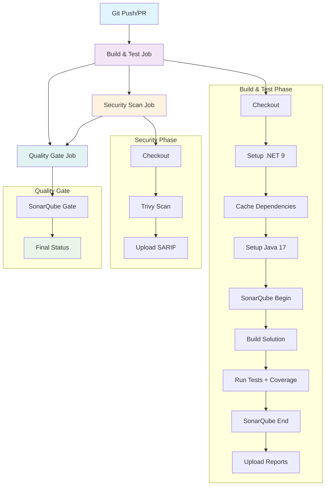

## Workflow Overview

**Purpose**: Automated CI/CD pipeline for .NET 9 solution with integrated code quality, security scanning, and test coverage analysis
**Trigger Events**: Push/PR to master & develop branches
**Target Environments**: GitHub-hosted runners (ubuntu-latest)

## Execution Flow Diagram



## Jobs & Dependencies

| Job Name | Purpose | Dependencies | Execution Context | Timeout |
|----------|---------|--------------|-------------------|---------|
| build-and-test | Build, test, SAST analysis | None | ubuntu-latest | 30 min |
| security-scan | Vulnerability scanning | build-and-test | ubuntu-latest | 10 min |
| quality-gate | Quality validation | build-and-test, security-scan | ubuntu-latest | 5 min |

## Requirements Matrix

### Functional Requirements
| ID | Requirement | Priority | Acceptance Criteria |
|----|-------------|----------|-------------------|
| REQ-001 | Build .NET 9 solution successfully | High | Zero build errors, all projects compile |
| REQ-002 | Execute all unit tests | High | All tests pass, minimum 80% coverage |
| REQ-003 | Generate code coverage reports | High | OpenCover XML format, HTML reports |
| REQ-004 | Perform SAST analysis | High | SonarQube analysis completes |
| REQ-005 | Security vulnerability scanning | Medium | Trivy scan executes, SARIF uploaded |
| REQ-006 | Quality gate validation | High | SonarQube quality gate passes |

### Security Requirements
| ID | Requirement | Implementation Constraint |
|----|-------------|---------------------------|
| SEC-001 | Secure secret management | Use GitHub Secrets for tokens |
| SEC-002 | Vulnerability scanning | Trivy filesystem scan |
| SEC-003 | SAST integration | SonarQube analysis required |
| SEC-004 | SARIF upload | Security findings in GitHub Security tab |

### Performance Requirements
| ID | Metric | Target | Measurement Method |
|----|-------|--------|-------------------|
| PERF-001 | Total pipeline time | < 45 minutes | GitHub Actions runtime |
| PERF-002 | Build time | < 5 minutes | dotnet build duration |
| PERF-003 | Test execution | < 10 minutes | dotnet test duration |
| PERF-004 | Cache hit ratio | > 90% | NuGet/SonarQube cache efficiency |

## Input/Output Contracts

### Inputs

```yaml
# Environment Variables
DOTNET_VERSION: "9.0.x"  # Purpose: .NET SDK version
SOLUTION_PATH: "TurboCat.CatCar.slnx"  # Purpose: Solution file path

# Repository Triggers
branches: [master, develop]  # Target branches
events: [push, pull_request]  # Trigger events
```

### Outputs

```yaml
# Artifacts
test-results: "**/*.trx"  # Purpose: Test execution results
coverage-reports: "./coverage/**"  # Purpose: Code coverage data
trivy-sarif: "trivy-results.sarif"  # Purpose: Security scan results

# Reports
sonarqube-analysis: "SonarCloud dashboard"  # Purpose: Code quality metrics
codecov-report: "Codecov dashboard"  # Purpose: Coverage visualization
```

### Secrets & Variables

| Type | Name | Purpose | Scope |
|------|------|---------|-------|
| Secret | GITHUB_TOKEN | Repository access | Workflow |
| Secret | SONAR_TOKEN | SonarQube authentication | Workflow |
| Secret | SONAR_PROJECT_KEY | SonarQube project identifier | Workflow |
| Secret | SONAR_ORGANIZATION | SonarQube organization | Workflow |

## Execution Constraints

### Runtime Constraints

- **Timeout**: 30 minutes (build-and-test), 10 minutes (security-scan), 5 minutes (quality-gate)
- **Concurrency**: Single job execution per branch
- **Resource Limits**: GitHub-hosted runner limitations

### Environmental Constraints

- **Runner Requirements**: Ubuntu latest, .NET 9 SDK, Java 17 JDK
- **Network Access**: SonarCloud.io, Codecov.io, GitHub APIs
- **Permissions**: Contents read, security events write, checks write

## Error Handling Strategy

| Error Type | Response | Recovery Action |
|------------|----------|-----------------|
| Build Failure | Fail pipeline immediately | Review build logs, fix compilation errors |
| Test Failure | Continue with reporting | Review test logs, fix failing tests |
| SonarQube Failure | Fail quality gate | Review quality issues, fix violations |
| Security Scan Failure | Continue pipeline | Review security findings |
| Quality Gate Failure | Fail pipeline | Address quality gate conditions |

## Quality Gates

### Gate Definitions

| Gate | Criteria | Bypass Conditions |
|------|----------|-------------------|
| Build Success | Zero compilation errors | None |
| Test Success | All tests pass | None |
| Code Coverage | Minimum threshold (configurable) | Emergency hotfix |
| Security Scan | Complete without errors | Critical production issue |
| SonarQube Gate | Quality gate passes | Override with approval |

## Monitoring & Observability

### Key Metrics

- **Success Rate**: > 95% pipeline success
- **Execution Time**: Track per job and total pipeline
- **Cache Performance**: Monitor hit/miss ratios
- **Quality Trends**: SonarQube metrics over time

### Alerting

| Condition | Severity | Notification Target |
|-----------|----------|-------------------|
| Pipeline Failure | High | Development Team |
| Quality Gate Failure | Medium | Tech Lead |
| Security Issues | High | Security Team |

## Integration Points

### External Systems

| System | Integration Type | Data Exchange | SLA Requirements |
|--------|------------------|---------------|------------------|
| SonarCloud | REST API | Analysis data | 99% availability |
| Codecov | HTTP Upload | Coverage reports | Best effort |
| GitHub Security | SARIF Upload | Vulnerability data | 99% availability |

### Dependent Workflows

| Workflow | Relationship | Trigger Mechanism |
|----------|--------------|-------------------|
| Deployment | Downstream | Manual trigger on success |
| Release | Downstream | Tag-based trigger |

## Compliance & Governance

### Audit Requirements

- **Execution Logs**: 90-day retention in GitHub Actions
- **Approval Gates**: Quality gate validation required
- **Change Control**: PR-based workflow updates

### Security Controls

- **Access Control**: Repository collaborator permissions
- **Secret Management**: GitHub Secrets rotation
- **Vulnerability Scanning**: Every commit/PR

## Edge Cases & Exceptions

### Scenario Matrix

| Scenario | Expected Behavior | Validation Method |
|----------|-------------------|-------------------|
| Intermittent SonarQube failures | Retry mechanism | Manual re-run |
| Large solution build timeout | Increase timeout | Monitor build times |
| Test flakiness | Report but continue | Review test reliability |
| Network connectivity issues | Graceful degradation | Check external service status |

## Validation Criteria

### Workflow Validation

- **VLD-001**: All jobs complete successfully
- **VLD-002**: Test coverage meets minimum threshold
- **VLD-003**: SonarQube quality gate passes
- **VLD-004**: Security scan completes without critical issues

### Performance Benchmarks

- **PERF-001**: Pipeline completes within timeout limits
- **PERF-002**: Cache utilization optimizes build times
- **PERF-003**: Resource usage within runner limits

## Change Management

### Update Process

1. **Specification Update**: Modify this document first
2. **Review & Approval**: PR review by DevOps team
3. **Implementation**: Apply changes to workflow YAML
4. **Testing**: Validate on feature branch
5. **Deployment**: Merge to master/develop

### Version History

| Version | Date | Changes | Author |
|---------|------|---------|--------|
| 1.0 | 2025-01-29 | Initial specification | DevOps Team |

## Related Specifications

- [Deployment Pipeline Specification](./spec-process-deployment.md)
- [Security Scanning Standards](./spec-security-standards.md)
- [Code Quality Guidelines](./spec-quality-guidelines.md)

---

## Current Implementation Issues & Recommendations

### Identified Issues

1. **Missing Timeout Configuration**: Jobs lack explicit timeout settings
2. **Tool Installation Inefficiency**: Global tool installations not cached
3. **Quality Gate Dependencies**: Incorrect file path reference
4. **Security Scan Optimization**: Could run in parallel with build
5. **Error Handling**: Limited retry mechanisms
6. **Resource Optimization**: Missing build artifact caching

### Recommended Fixes

1. Add explicit timeouts to all jobs
2. Cache global tools installation
3. Fix SonarQube metadata file path
4. Optimize job dependencies for parallel execution
5. Add retry mechanisms for external service calls
6. Implement build artifact caching strategy
